# Reconocimiento y Enumeración con Metasploitable 2

## Objetivo

Realizar reconocimiento y enumeración sobre una máquina Metasploitable 2 dentro de una red de laboratorio.

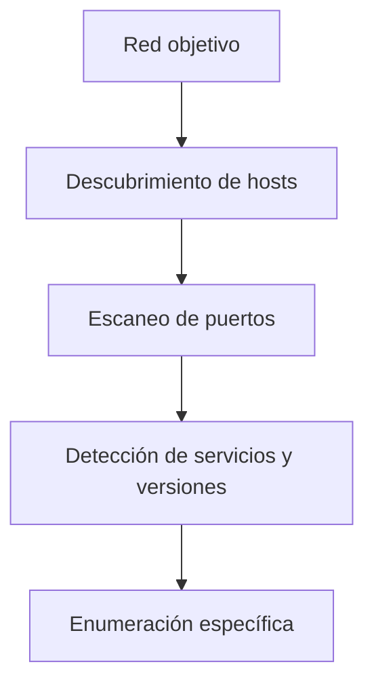

---

# 1. Identificar nuestra red

Primero revisamos la configuración de Kali:

```bash
ip addr
```

Ejemplo:

```text
inet 192.168.56.10/24
```

Esto nos indica:

```text
IP de Kali: 192.168.56.10
Red: 192.168.56.0/24
```

---

# LAB 1 — Descubrimiento de hosts

Buscamos qué dispositivos están activos en nuestra red:

```bash
sudo nmap -sn 192.168.56.0/24
```

`-sn` realiza descubrimiento de hosts sin escanear puertos.

Ejemplo:

```text
192.168.56.1     Host is up
192.168.56.10    Host is up
192.168.56.105   Host is up
```

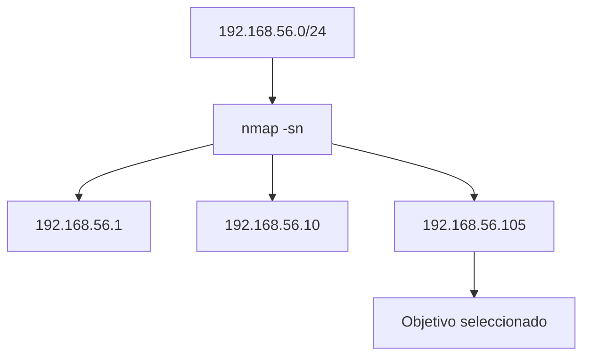

Objetivo:

```text
192.168.56.105
```

---

# LAB 2 — Escaneo de puertos

Escaneo básico:

```bash
nmap 192.168.56.105
```

Ejemplo:

```text
PORT     STATE SERVICE
21/tcp   open  ftp
22/tcp   open  ssh
23/tcp   open  telnet
25/tcp   open  smtp
80/tcp   open  http
139/tcp  open  netbios-ssn
445/tcp  open  microsoft-ds
```

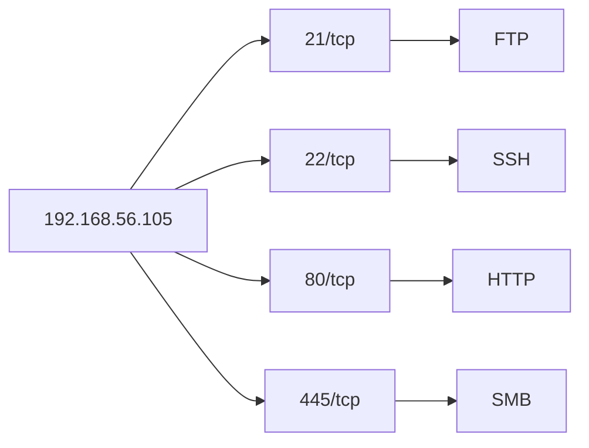

Para revisar todos los puertos TCP:

```bash
nmap -p- 192.168.56.105
```

`-p-` revisa los puertos TCP del `1` al `65535`.

---

# LAB 3 — Servicios y versiones

Ahora identificamos el software que funciona detrás de cada puerto:

```bash
nmap -sV 192.168.56.105
```

Ejemplo:

```text
21/tcp open ftp  vsftpd 2.3.4
22/tcp open ssh  OpenSSH 4.7p1
80/tcp open http Apache
```

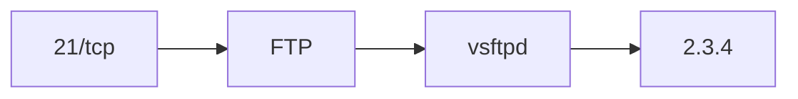

Interpretación:

```text
FTP       → servicio
vsftpd    → software
2.3.4     → versión
```

---

# 2. Enumeración de servicios

Una vez encontrados los servicios, los investigamos de forma individual.

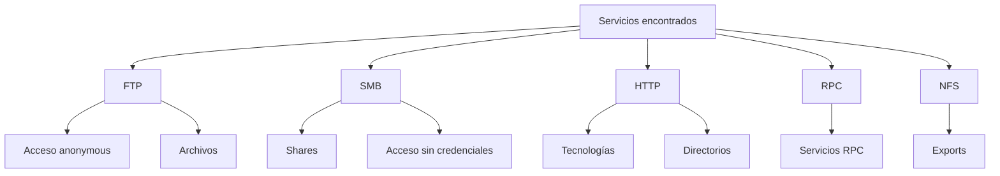

---

# LAB 4 — Enumeración FTP

Confirmamos el servicio:

```bash
nmap -p21 -sV 192.168.56.105
```

Nos conectamos:

```bash
ftp 192.168.56.105
```

Probar:

```text
Name: anonymous
```

Una vez dentro:

```bash
pwd
ls
```

También podemos comprobar acceso anónimo con Nmap:

```bash
nmap -p21 --script ftp-anon 192.168.56.105
```

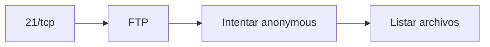

---

# LAB 5 — Enumeración SMB

Confirmamos SMB:

```bash
nmap -p139,445 -sV 192.168.56.105
```

Listamos recursos compartidos:

```bash
smbclient -L //192.168.56.105 -N
```

Opciones:

```text
-L  → listar shares
-N  → no solicitar contraseña
```

También podemos usar NSE:

```bash
nmap -p139,445 --script smb-enum-shares 192.168.56.105
```


---

# LAB 6 — Enumeración HTTP

Confirmamos el servicio web:

```bash
nmap -p80 -sV 192.168.56.105
```

Revisamos cabeceras:

```bash
curl -I http://192.168.56.105
```

Identificamos tecnologías:

```bash
whatweb http://192.168.56.105
```

Buscamos directorios:

```bash
gobuster dir -u http://192.168.56.105 -w /usr/share/wordlists/dirb/common.txt
```

Podemos encontrar rutas como:

```text
/admin
/images
/uploads
/dvwa
/phpMyAdmin
```

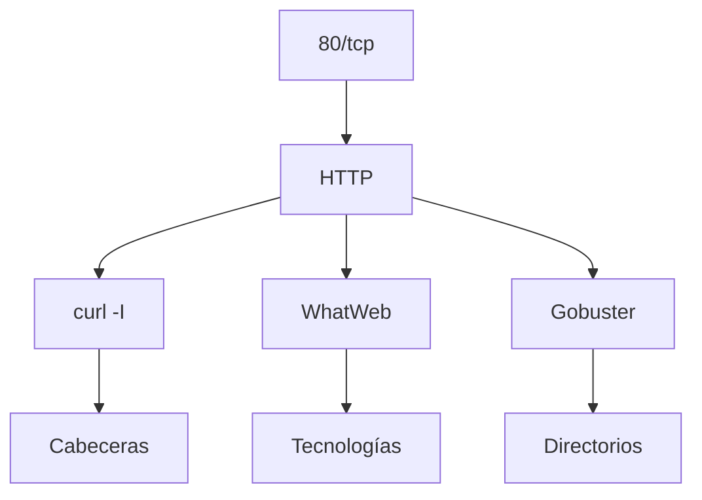

---

# LAB 7 — Enumeración RPC

Si encontramos:

```text
111/tcp open rpcbind
```

Ejecutamos:

```bash
rpcinfo -p 192.168.56.105
```

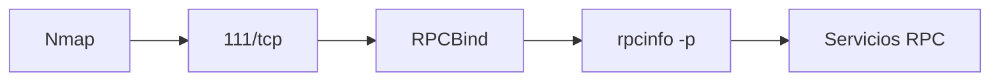

---

# LAB 8 — Enumeración NFS

Confirmamos NFS:

```bash
nmap -p2049 -sV 192.168.56.105
```

Listamos directorios exportados:

```bash
showmount -e 192.168.56.105
```

Ejemplo:

```text
Export list for 192.168.56.105:
/ *
```


RPC también puede llevarnos al descubrimiento de NFS:

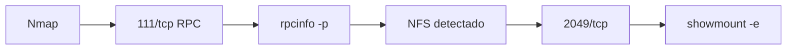

---

# LAB FINAL — Enumeración desde cero

Se entrega únicamente la red:

```text
192.168.56.0/24
```

## Paso 1 — Identificar nuestra red

```bash
ip addr
```

## Paso 2 — Descubrir hosts

```bash
sudo nmap -sn 192.168.56.0/24
```

## Paso 3 — Seleccionar el objetivo

Ejemplo:

```text
192.168.56.105
```

Podemos guardar la IP en una variable:

```bash
IP=192.168.56.105
```

Comprobar:

```bash
echo $IP
```

---

## Paso 4 — Escanear puertos

```bash
nmap $IP
```

Todos los puertos TCP:

```bash
nmap -p- $IP
```

---

## Paso 5 — Detectar servicios y versiones

```bash
nmap -sV $IP
```

---

## Paso 6 — FTP

```bash
nmap -p21 -sV $IP
ftp $IP
```

Probar:

```text
anonymous
```

Comprobación automática:

```bash
nmap -p21 --script ftp-anon $IP
```

---

## Paso 7 — SMB

```bash
nmap -p139,445 -sV $IP
```

```bash
smbclient -L //$IP -N
```

```bash
nmap -p139,445 --script smb-enum-shares $IP
```

---

## Paso 8 — HTTP

```bash
nmap -p80 -sV $IP
```

```bash
curl -I http://$IP
```

```bash
whatweb http://$IP
```

```bash
gobuster dir -u http://$IP -w /usr/share/wordlists/dirb/common.txt
```

---

## Paso 9 — RPC

```bash
rpcinfo -p $IP
```

---

## Paso 10 — NFS

```bash
nmap -p2049 -sV $IP
```

```bash
showmount -e $IP
```

---

# Flujo completo

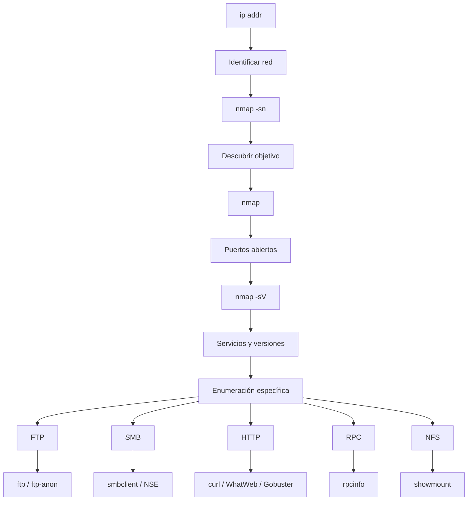

---

# Resultado de la enumeración

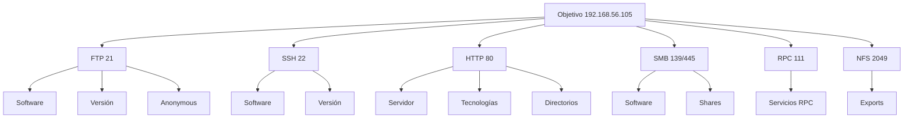

# Comandos principales

```bash
# Identificar la red
ip addr

# Descubrir hosts
sudo nmap -sn 192.168.56.0/24

# Escaneo básico
nmap $IP

# Todos los puertos TCP
nmap -p- $IP

# Servicios y versiones
nmap -sV $IP

# FTP
ftp $IP
nmap -p21 --script ftp-anon $IP

# SMB
smbclient -L //$IP -N
nmap -p139,445 --script smb-enum-shares $IP

# HTTP
curl -I http://$IP
whatweb http://$IP
gobuster dir -u http://$IP -w /usr/share/wordlists/dirb/common.txt

# RPC
rpcinfo -p $IP

# NFS
showmount -e $IP
```
