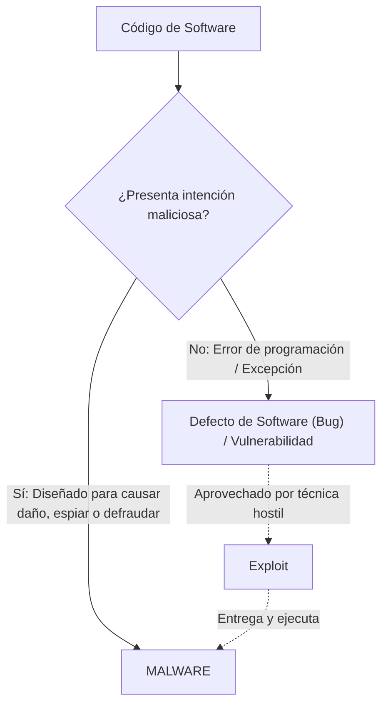
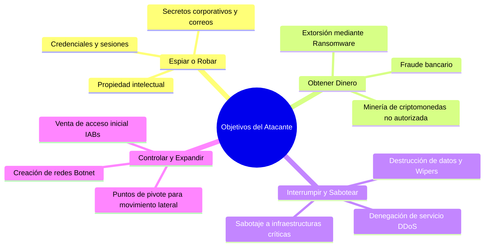
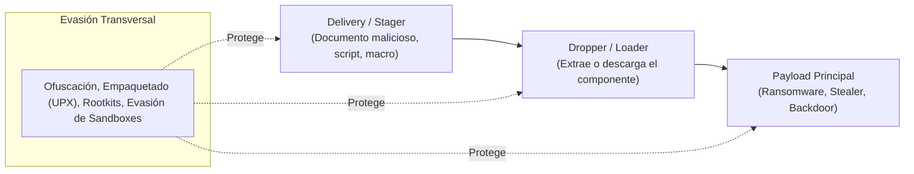
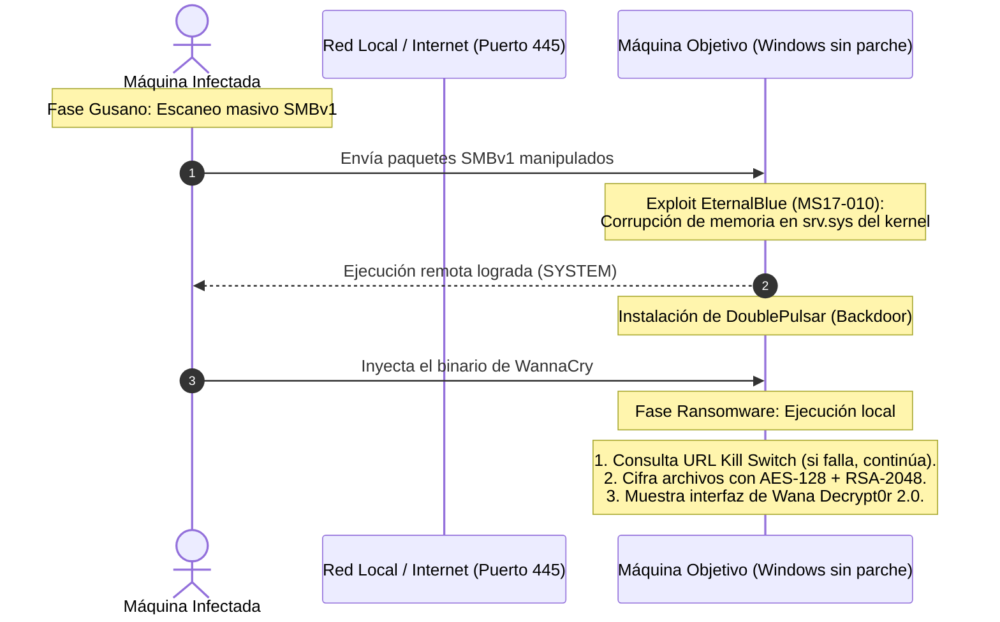
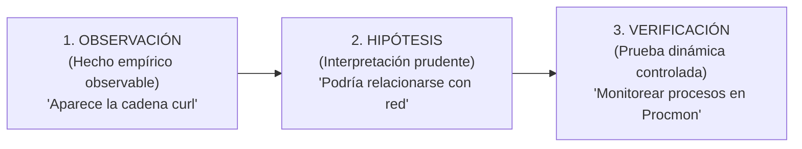

# Capítulo 01: Fundamentos del Malware, Taxonomía y Rol del Analista

[Inicio](../../README.md) | [Análisis de Malware](../README.md) | [Siguiente: Entornos Seguros y Laboratorio](../02-entornos-seguros-y-laboratorio/README.md)

| Campo | Valor |
|---|---|
| Estado | Disponible |
| Duración estimada | 3 a 4 horas |
| Nivel | Inicial |
| Modalidad | Lectura teórica en profundidad, análisis de casos históricos y metodología analítica |
| Prerrequisitos | Conceptos básicos de sistemas operativos y redes |

---

## Objetivos de aprendizaje

Al finalizar este capítulo serás capaz de:

- Definir con precisión técnica qué constituye malware y distinguir entre fallos de programación (*bugs*), vulnerabilidades, exploits y código malicioso.
- Explicar las motivaciones estratégicas de los atacantes y desglosar las etapas de una cadena de infección estándar.
- Dominar el vocabulario operativo de la cadena de compromiso: *delivery*, *stager*, *dropper*, *loader*, *payload* y técnicas de evasión.
- Aplicar el modelo de clasificación multidimensional de cuatro ejes (Entrada, Propagación, Capacidad y Evasión) superando taxonomías rígidas o reduccionistas.
- Analizar casos de estudio históricos emblemáticos (CIH/Chernobyl, Emotet, RedLine Stealer, Mirai Botnet).
- Desglosar la anatomía técnica completa de la epidemia de **WannaCry (2017)**, justificando por qué operó como gusano de propagación y ransomware de carga útil, y clarificando el funcionamiento real del mecanismo de "Kill Switch".
- Adoptar la metodología científica del analista de malware basada en el ciclo: **Observación $\rightarrow$ Hipótesis $\rightarrow$ Verificación**, redactando hallazgos técnicos con prudencia y reproducibilidad.

---

## 1. ¿Qué es el malware? Causa raíz y límites conceptuales

El término **malware** (contracción de *malicious software*) describe cualquier programa, script, archivo o conjunto de instrucciones concebido o alterado con **intención deliberadamente hostil o maliciosa**: robar información, espiar comunicaciones, interrumpir servicios, controlar infraestructuras o causar daño económico y operativo.



> [!IMPORTANT]
> **Axioma fundamental**: Un error de software, una excepción no controlada o una vulnerabilidad de seguridad por sí solos **no constituyen malware**. El malware se define por la conjunción de código ejecutable e intención maliciosa expresa.

### La distinción crítica: Vulnerabilidad $\neq$ Exploit $\neq$ Malware

En incidentes de seguridad y divulgación técnica es muy frecuente confundir estos tres conceptos. Un analista debe diferenciarlos con rigor quirúrgico:

| Concepto | Definición técnica | Rol en el ataque | Ejemplo canónico (Caso WannaCry) |
|---|---|---|---|
| **Vulnerabilidad** | La debilidad, defecto de diseño o fallo de implementación en un componente de software o configuración de sistema. | La "puerta abierta" o cerradura defectuosa. | **MS17-010 / SMBv1**: Fallo en el tratamiento de paquetes SMBv1 en el kernel de Windows. |
| **Exploit** | La técnica, payload o fragmento de código específico diseñado para aprovechar la vulnerabilidad y forzar una condición anómala en el objetivo. | La llave forzada que atraviesa la cerradura rota. | **EternalBlue**: Exploit desarrollado para abusar del fallo MS17-010 y lograr ejecución remota de código (RCE). |
| **Malware** | El software autónomo que se ejecuta tras la intrusión para cumplir los objetivos maliciosos finales del atacante. | El intruso que entra en la casa, roba pertenencias o cambia las cerraduras. | **WannaCry**: Binario malicioso que cifra los archivos locales y exige un rescate económico. |

---

## 2. Motivaciones del atacante y ciclo de infección

Los operadores de malware desarrollan y despliegan artefactos maliciosos guiados por objetivos estratégicos concretos:



### Ciclo de una infección paso a paso

```text
[ 1. ENTRADA ] ───> [ 2. EJECUCIÓN ] ───> [ 3. ACCIONES EN HOST ] ───> [ 4. IMPACTO ]
  Phishing, USB,      El usuario abre       Se instala persistencia,     Pérdida de datos,
  servicio expuesto,  el archivo o un       roba credenciales,           cifrado de archivos,
  software alterado   exploit lo activa     descarga payloads o espía    extorsión financiera
```

> [!TIP]
> **Idea clave**: El vector de entrada (ej. un correo de phishing) describe **cómo llegó** el artefacto; la capacidad (ej. ransomware) describe **lo que hace**. No son categorías equivalentes ni mutuamente excluyentes.

---

## 3. Vocabulario operativo de la cadena de infección

El malware moderno rara vez se distribuye como un único binario que realiza todo el proceso de golpe. Para evadir antivirus y controles perimetrales, los atacantes dividen el compromiso en etapas (*stages*):



1. **Delivery / Stager**: El componente inicial ligero diseñado para penetrar el perímetro y contactar con la infraestructura del atacante.
2. **Dropper / Loader**:
   - **Dropper**: Archivo que contiene dentro de sus propios recursos el payload malicioso (a menudo cifrado o comprimido) y lo "suelta" (*drops*) en el disco del sistema víctima.
   - **Loader**: Archivo liviano cuya función exclusiva es descargar el payload desde un servidor remoto en Internet y cargarlo en la memoria del sistema.
3. **Payload**: El componente ejecutable final que materializa el impacto lesivo (cifrado, extracción de información, escucha de comandos).
4. **Técnicas de Evasión**: Mecanismos transversales (cifrado de cadenas, detección de máquinas virtuales, empaquetado) utilizados en cualquiera de las fases anteriores para dificultar el análisis.

---

## 4. Taxonomía multidimensional del malware

Históricamente se intentaba etiquetar cada muestra con un solo nombre ("esto es un troyano", "esto es un gusano"). Sin embargo, las familias de amenazas contemporáneas combinan múltiples capacidades híbridas.

En lugar de memorizar definiciones cerradas, el analista clasifica una muestra respondiendo a **cuatro dimensiones operativas**:

| Dimensión analítica | Pregunta rectora | Ejemplos de implementación |
|---|---|---|
| **1. Entrada** | ¿Cómo ingresó al equipo víctima? | Correo de phishing con adjunto, explotación de servicio vulnerable expuesto a Internet, dispositivo USB infectado, instalador troyanizado descargado de la web. |
| **2. Propagación** | ¿Posee la capacidad de extenderse a otros sistemas de forma autónoma? | **Sin propagación** (se limita al equipo infectado), **Infector de archivos** (modifica ejecutables locales legítimos), **Gusano de red** (escanea la subred o Internet explotando vulnerabilidades). |
| **3. Capacidad** | ¿Qué acciones realiza sobre el sistema una vez ejecutado? | Ransomware (cifra archivos), Info Stealer (sustrae contraseñas de navegadores), Spyware/Keylogger (captura pulsaciones de teclado), RAT/Backdoor (control remoto interactivo), Bot (recibe órdenes de un C2 para DDoS). |
| **4. Evasión** | ¿Cómo intenta ocultar su presencia a los defensores y analistas? | Ofuscación de cadenas, empaquetado con packers (UPX, Themida), detección de depuradores (*anti-debugging*), detección de hipervisores (*anti-VM*), rootkits (ocultación de procesos en el kernel). |

```text
Ejemplo práctico de clasificación híbrida:
Un artefacto que llega por correo electrónico disfrazado de factura (TROYANO de entrada),
escanea la red local mediante un exploit para infectar otros servidores (GUSANO de propagación),
cifra los documentos exigiendo un rescate en criptomonedas (RANSOMWARE de capacidad)
y oculta sus hilos de ejecución mediante compresión y cifrado (EMPAQUETADO de evasión).
```

---

## 5. Casos de estudio históricos de referencia

Para comprender la evolución del malware, examinemos cuatro casos paradigmáticos que moldearon la industria de la seguridad informática:

```text
CASOS HISTÓRICOS PARADIGMÁTICOS:
├── 1. CIH / Chernobyl (1998)   -> VIRUS (Infección de ejecutables PE y destrucción de BIOS)
├── 2. Emotet (2014-2021)       -> TROYANO MODULAR (Distribución masiva de TrickBot y Ryuk)
├── 3. RedLine Stealer (2020-)  -> INFO STEALER (MaaS: Robo masivo de credenciales y cookies)
└── 4. Mirai Botnet (2016)      -> BOTNET IoT (Compromiso por credenciales default y DDoS récord)
```

### 5.1 Virus: Caso CIH / Chernobyl (1998)
- **Concepto**: Un **virus** se adhiere a un archivo ejecutable legítimo anfitrión y requiere que dicho archivo sea ejecutado por un usuario para propagarse e infectar otros programas del disco.
- **Impacto de CIH**: Desarrollado en Taiwán, infectaba ejecutables PE en Windows 95 y Windows 98 aprovechando los espacios vacíos entre secciones (*cave jumping*).
- **Carga destructiva**: Programado para detonar el 26 de abril (aniversario del desastre de Chernobyl), el virus sobreescribía el primer megabyte del disco duro (destruyendo la tabla de particiones MBR) y, en placas base con chipsets específicos, escribía datos basura en la memoria Flash BIOS, dejando el equipo físicamente inoperativo (*bricked*).

### 5.2 Troyano Modular: Caso Emotet (2014–2021)
- **Concepto**: Un **troyano** se presenta como un archivo legítimo, inofensivo o atractivo (factura, documento de Word, actualización) para engañar al usuario y lograr su ejecución.
- **Evolución de Emotet**: Comenzó en 2014 como un troyano bancario para interceptar credenciales financieras. Con el paso de los años, evolucionó hacia una gigantesca infraestructura de **Malware-as-a-Service (MaaS)** especializada en envío masivo de correos maliciosos contextualizados (*thread hijacking*).
- Emotet actuaba como la puerta de entrada inicial (*loader*), vendiendo el acceso comprometido a otros grupos cibercriminales para descargar troyanos de segunda etapa como **TrickBot** y finalizar con el despliegue del temido ransomware corporativo **Ryuk**.

### 5.3 Info Stealer: Caso RedLine Stealer (2020–presente)
- **Concepto**: Un **info stealer** es un malware especializado en la recolección sigilosa y exfiltración de credenciales de acceso almacenadas en el equipo.
- **Alcance de RedLine**: Comercializado en foros clandestinos mediante suscripción mensual. Se infiltra camuflado en instaladores de videojuegos piratas, cracks o campañas de phishing dirigidas.
- **Objetivos de extracción**:
  - Bases de datos SQLite de navegadores Chrome, Firefox, Edge y Brave (extrayendo contraseñas guardadas, cookies de sesión activas y datos de autocompletado).
  - Monederos de criptomonedas (extensiones de navegador y billeteras locales como MetaMask, Electrum, Exodus).
  - Tokens de autenticación de Discord, Telegram y sesiones VPN.
  - Perfil de hardware e información del sistema operativo.
- Estas credenciales robadas se empaquetan en archivos comprimidos denominados *logs* y se comercializan en mercados delictivos para la toma masiva de cuentas corporativas.

### 5.4 Botnet: Caso Mirai (2016)
- **Concepto**: Una **botnet** es una red distribuida de dispositivos informáticos comprometidos (*bots* o *zombis*) controlados remotamente por un operador (*botmaster*) a través de un canal C2 (Command & Control).
- **Vector de Mirai**: Diseñado para arquitecturas embebidas Linux (ARM, MIPS, x86), Mirai escaneaba masivamente el espacio de direcciones IPv4 en los puertos 23/TCP (Telnet) y 22/TCP (SSH), ejecutando ataques de diccionario contra una lista fija de solo 62 combinaciones de usuario y contraseña por defecto utilizadas por cámaras IP, grabadores DVR y routers domésticos.
- **Impacto**: La botnet coordinó ataques de Denegación de Servicio Distribuida (DDoS) superiores a **620 Gbps** contra el portal de investigación *Krebs on Security* y, posteriormente, contra el proveedor de infraestructura DNS **Dyn**, interrumpiendo el acceso en gran parte del mundo a servicios como Twitter, Netflix, Spotify y GitHub.

---

## 6. Caso de Estudio Profundo: WannaCry (Mayo de 2017)

WannaCry representa el caso de estudio definitivo para ejercitar la clasificación técnica multidimensional.



### 1. La superficie técnica de la víctima
El 12 de mayo de 2017, pantallas en hospitales del Servicio Nacional de Salud británico (NHS), cajeros automáticos, pantallas de la compañía ferroviaria alemana Deutsche Bahn y redes corporativas de telecomunicaciones en más de 150 países fueron bloqueadas por una ventana roja: **Wana Decrypt0r 2.0**.

Los documentos personales, bases de datos y archivos críticos aparecían renombrados con la extensión `.WNCRY`. La interfaz exigía el pago de 300 dólares estadounidenses en Bitcoin, amenazando con duplicar el monto pasados 3 días y destruir permanentemente la clave de descifrado tras 7 días.

### 2. ¿Por qué se propagó con tanta velocidad?
A diferencia de los troyanos habituales, **WannaCry no necesitó que ningún usuario abriese un correo ni hiciese clic en un enlace**.

1. **Vulnerabilidad**: Un fallo crítico en el protocolo de compartición de archivos SMBv1 en sistemas Windows (identificado por Microsoft en el boletín **MS17-010** en marzo de 2017).
2. **Exploit**: El exploit **EternalBlue** (filtrado públicamente semanas antes por el grupo *Shadow Brokers*), que permitía a un atacante no autenticado enviar paquetes especialmente formateados al puerto 445/TCP y ejecutar código arbitrario en el contexto del núcleo (*SYSTEM*).
3. **Mecanismo de propagación autónoma (Gusano)**: Cada equipo infectado iniciaba de inmediato hilos de ejecución que escaneaban direcciones IP dentro de su red local y en Internet en busca del puerto 445 abierto, explotando automáticamente a cualquier host vulnerable sin interacción humana.

### 3. El mito y la realidad del "Kill Switch"
Durante las primeras horas del brote global, el investigador de seguridad Marcus Hutchins (*MalwareTech*) analizó las cadenas del binario extraído y detectó una petición HTTP inusual hacia un dominio no registrado:

```text
http://www.iuqerfsodp9ifjaposdfjhgosurijfaewrwergwea.com
```

- **Mecánica del código**: Antes de iniciar el cifrado de archivos, la primera variante de WannaCry intentaba conectarse a esa URL.
  - Si la conexión **fallaba** (dominio inexistente), el malware interpretaba que se encontraba en un entorno real con Internet bloqueada o sin proxy y **procedía con la infección y el cifrado**.
  - Si la conexión **tenía éxito**, el malware asumía que estaba siendo ejecutado dentro de un entorno de análisis (*sandbox* de malware que simula respuestas a cualquier petición web) y **se autodetenía de forma silenciosa**.
- **La contención**: Al registrar el dominio por unos pocos dólares y configurarlo para responder peticiones, Hutchins activó la condición de detención en los miles de equipos que intentaban infectarse en ese momento, frenando el avance de esa variante específica.

> [!CAUTION]
> **Importante para el analista**: El registro del dominio del "Kill Switch" **frenó la propagación a nuevas máquinas**, pero **no descifró ni recuperó un solo archivo** en las máquinas que ya habían sido infectadas con anterioridad, ni solucionó la vulnerabilidad SMBv1 en Windows.

### 4. Síntesis clasificatoria de WannaCry

```text
┌─────────────────┬────────────────────────────────────────────────────────┐
│ Dimensión       │ Clasificación en WannaCry                              │
├─────────────────┼────────────────────────────────────────────────────────┤
│ Vulnerabilidad  │ Fallo de desbordamiento en SMBv1 (MS17-010 / CVE-2017-0144)│
│ Exploit         │ EternalBlue + DoublePulsar                             │
│ Propagación     │ Gusano de red autónomo por puerto 445/TCP              │
│ Capacidad       │ Ransomware criptográfico (cifrado RSA-2048 + AES-128)   │
└─────────────────┴────────────────────────────────────────────────────────┘
Axioma rector: "WannaCry fue un gusano por cómo se movía, y un ransomware por lo que hacía."
```

---

## 7. El rol del analista y la metodología científica

Un analista de malware no es un adivino que ejecuta herramientas al azar; es un investigador forense que transforma un artefacto binario desconocido en **respuestas operativas reproducibles y verificables**:

### ¿Qué es una muestra (*sample*)?
Cualquier archivo ejecutable, librería DLL, documento ofuscado o script recuperado durante la contención de un incidente.
- **Principio de neutralidad**: Una muestra se investiga con presunción técnica neutra; el objetivo del análisis no es "demostrar que es malware a la fuerza", sino determinar con rigor qué contiene y qué capacidades reales posee.

### Los productos del análisis de malware
1. **Ficha Técnica y Evidencias Reproducibles**: Documentación paso a paso de lo observado (comandos, hashes, volcados hexadecimales).
2. **Indicadores de Compromiso (IOCs)**: Pistas técnicas estructuradas (hashes de archivos, nombres de procesos, claves de registro alteradas, dominios e IPs C2) que permiten a los equipos defensivos (SOC y Blue Team) cazar la amenaza en toda la red corporativa.
3. **Inteligencia de Amenazas (CTI)**: Atribución técnica a familias conocidas, correspondencia con matrices tácticas (MITRE ATT&CK) y patrones de infraestructura.
4. **Recomendaciones de Contención**: Medidas inmediatas para aislar hosts, bloquear dominios en firewalls perimetrales y aplicar parches correctivos.

### El método científico en análisis de malware



> [!WARNING]
> **Regla de oro de redacción técnica**:  
> - **Incorreto (Afirmación no demostrada)**: *"El archivo se conecta a la IP 192.168.56.20 y roba contraseñas de Chrome."* (Observar una cadena de texto en reposo no demuestra que el código la ejecute).
> - **Correcto (Lenguaje forense)**: *"El análisis estático identificó cadenas que hacen referencia a 'Chrome/Login Data' y a la dirección '192.168.56.20'. Se formula la hipótesis de que el binario podría poseer capacidades de robo de credenciales, lo cual requiere verificación en la fase de análisis dinámico."*

---

## Preguntas de autoevaluación

1. Explica la diferencia técnica entre una vulnerabilidad, un exploit y un malware, utilizando el caso de WannaCry como ejemplo.
2. ¿Por qué es conceptualmente erróneo clasificar a un malware utilizando una única etiqueta rígida como "troyano"?
3. ¿Cuál es la función específica de un *dropper* o *loader* en una cadena de infección moderna y por qué los atacantes separan estas etapas del payload principal?
4. ¿Qué mecanismo técnico provocó que el gusano Mirai infectara cientos de miles de dispositivos IoT en cuestión de horas?
5. Explica el funcionamiento exacto del llamado "Kill Switch" de WannaCry y desmiente dos mitos frecuentes sobre sus efectos.
6. Si durante la inspección de un ejecutable encuentras la cadena `C:\Windows\System32\cmd.exe`, ¿por qué no debes afirmar que el malware ejecuta comandos en la terminal?

---

[Volver al Índice de Análisis de Malware](../README.md) | [Siguiente: Entornos Seguros y Laboratorio](../02-entornos-seguros-y-laboratorio/README.md)
