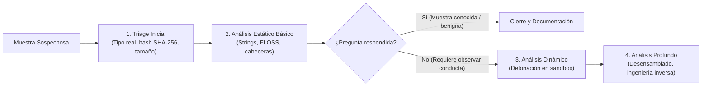
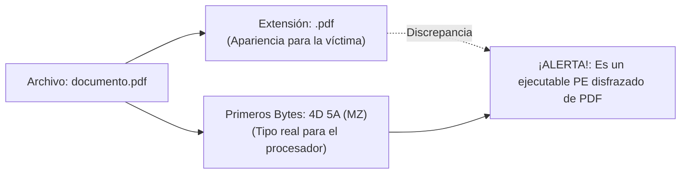
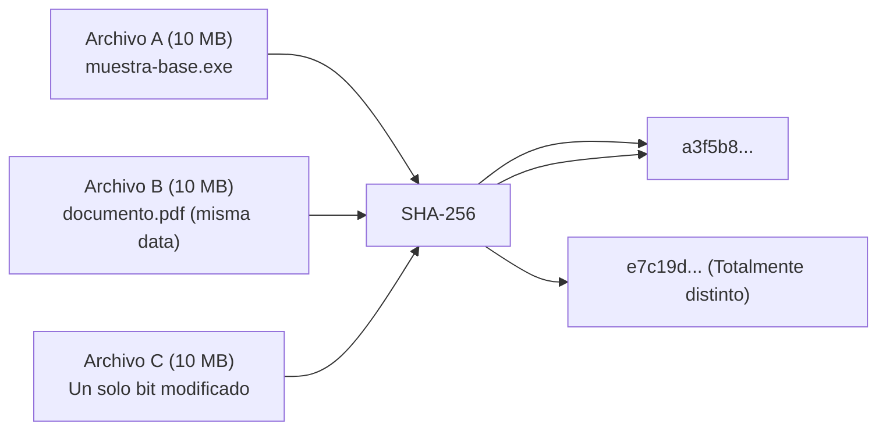
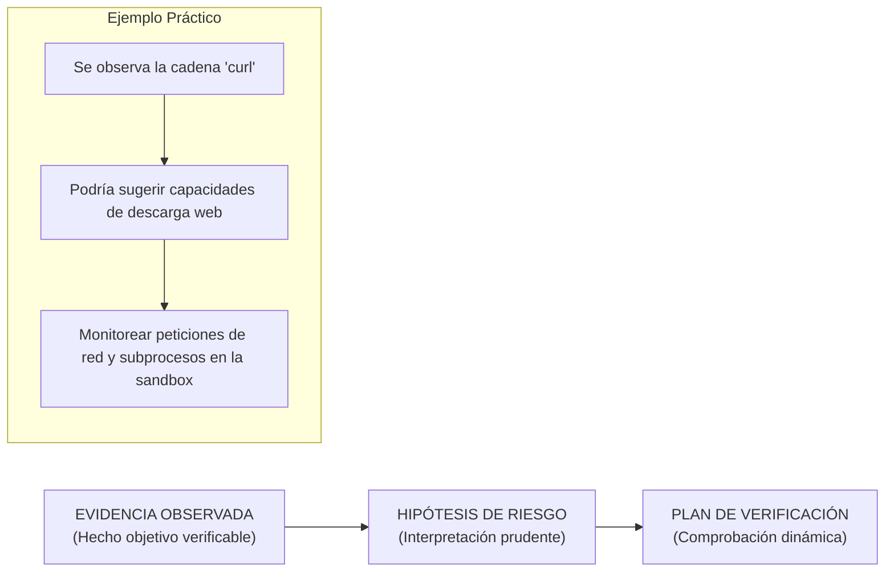

# Capítulo 03: Análisis Estático Inicial y Extracción de Artefactos

[Inicio](../../README.md) | [Análisis de Malware](../README.md) | [Anterior: Entornos Seguros](../02-entornos-seguros-y-laboratorio/README.md) | [Siguiente: Formato PE y Capacidades](../04-formato-pe-y-capacidades/README.md) | [Laboratorio Práctico](./lab/)

| Campo | Valor |
|---|---|
| Estado | Disponible |
| Duración estimada | 3 a 4 horas |
| Nivel | Inicial - Intermedio |
| Modalidad | Lectura teórica exhaustiva, análisis de binarios y laboratorio práctico en C/Linux |
| Prerrequisitos | Capítulo 01 (Taxonomía) y Capítulo 02 (Entornos Seguros) |

---

## Objetivos de aprendizaje

Al finalizar este capítulo serás capaz de:

- Aplicar el principio de proporcionalidad en el análisis de malware, reconociendo cuándo el análisis estático es suficiente para responder a un incidente.
- Determinar el tipo real de un archivo examinando sus números mágicos (*magic bytes*) y detectar extensiones falsas o fraudulentas.
- Calcular y correlacionar huellas digitales mediante el algoritmo criptográfico **SHA-256**, comprendiendo el efecto avalancha y los límites de los hashes como indicadores.
- Extraer cadenas de texto legibles diferenciando codificaciones **ASCII** y **UTF-16LE**.
- Clasificar artefactos textuales en categorías operativas (red, persistencia, credenciales, comandos y rutas de sistema).
- Utilizar la herramienta avanzada **FLOSS** (FLARE Obfuscated String Solver) para recuperar cadenas ofuscadas o generadas dinámicamente.
- Inspeccionar cabeceras estructurales básicas de binarios mediante utilidades de línea de comandos (`file`, `xxd`, `objdump`).
- Elaborar una **Ficha de Triaje** profesional separando con rigor las observaciones empíricas de las hipótesis no verificadas.

---

## 1. Fundamentos del análisis estático: Mirar sin ejecutar

El **análisis estático** consiste en la inspección forense de un archivo o programa **sin permitir que el procesador ejecute sus instrucciones**. Es la primera línea de investigación al recibir una muestra desconocida.



### El principio de proporcionalidad
> [!TIP]
> **Regla de oro**: *Avanza en la cadena de análisis únicamente si la pregunta de seguridad lo requiere*. El analista más eficiente no es el que abre inmediatamente un desensamblador complejo como Ghidra o IDA Pro, sino el que extrae la máxima información en los niveles de menor riesgo y tiempo.

### Evidencias observables vs. Afirmaciones no permitidas

Un error recurrente en analistas principiantes es saltar de un indicio estático a una conclusión definitiva:

| Lo que el análisis estático SÍ observa | Lo que el análisis estático NO demuestra |
|---|---|
| Bytes exactos y tipo de archivo real. | Qué acciones ejecutará el programa en runtime. |
| Arquitectura de destino (`x86`, `x86-64`, `ARM`). | Si una función, IP o cadena encontrada será realmente invocada. |
| Hashes criptográficos para correlación. | Si el archivo es definitiva y concluyentemente malicioso. |
| Cadenas de texto incrustadas en el binario. | El impacto final sobre los procesos y datos del sistema. |

---

## 2. Tipo real vs. Extensión de archivo: La verdad de los Magic Bytes

En sistemas operativos de usuario (como Windows), la **extensión** del archivo (`.pdf`, `.docx`, `.exe`) define qué icono se muestra en el explorador y qué aplicación predeterminada lo abre al hacer doble clic. Los atacantes abusan sistemáticamente de esta convención para inducir a engaño mediante extensiones dobles (`factura.pdf.exe`) o extensiones arbitrarias.



### ¿Cómo sabe el sistema operativo qué es un archivo en realidad?
El formato técnico de un archivo no lo define su nombre, sino sus **Magic Bytes** (números mágicos): una secuencia fija de bytes situada al comienzo de la cabecera (offset `0x00`).

| Formato | Nombre del formato | Magic Bytes (Hexadecimal) | Representación ASCII | Sistema Operativo habitual |
|---|---|---|---|---|
| **ELF** | Executable and Linkable Format | `7F 45 4C 46` | `\x7fELF` | Linux / BSD / Android |
| **PE / PE32+** | Portable Executable | `4D 5A` | `MZ` | Windows (EXE, DLL, SYS) |
| **Mach-O** | Mach Object | `FE ED FA CE` o `CF FA ED FE` | — | macOS / iOS |
| **PDF** | Portable Document Format | `25 50 44 46` | `%PDF` | Documentos Adobe |
| **ZIP / Office** | Contenedor comprimido PKZip | `50 4B 03 04` | `PK\x03\x04` | Archivos ZIP, DOCX, XLSX |

### Identificación técnica en la terminal
```bash
# Inspeccionar con la utilidad file
file documento.pdf
# Salida: documento.pdf: PE32+ executable (GUI) x86-64, for MS Windows

# Verificar directamente los primeros 4 bytes en hexadecimal
xxd -l 4 documento.pdf
# Salida: 00000000: 4d5a 9000  MZ..
```

> [!CAUTION]
> **Decisión analítica**: Si la extensión aparente y la firma binaria no coinciden, registra la discrepancia inmediatamente como indicio de ofuscación o ingeniería social y trata el archivo según el formato dictado por sus **bytes reales**. Renombrar un archivo nunca altera su contenido interno.

---

## 3. Identidad digital mediante hashes (SHA-256)

Una función hash criptográfica toma una secuencia arbitraria de bytes y produce una cadena alfanumérica de longitud fija (una **huella digital**).



### Propiedades fundamentales del hash SHA-256
1. **Determinismo**: Mismos bytes producen exactamente el mismo hash, independientemente de la máquina o el sistema operativo donde se calcule.
2. **Independencia del nombre**: Cambiar el nombre del archivo de `muestra.exe` a `documento.pdf` **no cambia un solo byte del hash**, ya que el hash se calcula exclusivamente sobre el contenido del archivo.
3. **Efecto Avalancha (*Avalanche Effect*)**: Modificar un único carácter o bit en todo el binario (ej. cambiar `"Version 1.0"` por `"Version 1.1"`) altera drásticamente y de forma impredecible toda la salida resultante.

### Alcance y límites de los hashes como Indicadores de Compromiso (IOC)
- **Lo que SÍ responde el hash**:
  - Identifica de forma unívoca una muestra exacta en una base de datos de incidentes.
  - Permite verificar si dos archivos en diferentes máquinas son réplicas exactas byte por byte.
  - Permite consultar en repositorios de inteligencia de amenazas (CTI) sin necesidad de enviar el archivo completo.
- **Lo que NO responde el hash**:
  - **No mide similitud**: Si un autor recompila su código con una variable modificada, el hash SHA-256 cambia al 100%, volviendo inútil la firma tradicional. *(Para medir similitud entre variantes se emplean algoritmos de Fuzzy Hashing como `ssdeep` o Imphash)*.
  - **No determina malicia**: Un hash solo describe una secuencia matemática de bytes, no si la intención del archivo es benigna o dañina.

---

## 4. Extracción y categorización de Strings

Una **cadena de texto (*string*)** es cualquier secuencia contigua de caracteres imprimibles (letras, números, símbolos y espacios) delimitada por bytes nulos (`0x00`) o caracteres de control dentro del binario.

### Codificaciones: ASCII frente a UTF-16LE
El analista debe tener presente que los programas de Windows utilizan frecuentemente dos formatos de texto:
1. **ASCII / UTF-8**: Cada carácter ocupa 1 byte.
   ```text
   Hexadecimal: 61 64 6d 69 6e
   Texto:       a  d  m  i  n
   ```
2. **UTF-16LE (Unicode de Windows)**: Cada carácter ocupa 2 bytes, alternando con bytes nulos (`0x00`):
   ```text
   Hexadecimal: 61 00 64 00 6d 00 69 00 6e 00
   Texto:       a \0  d \0  m \0  i \0  n \0
   ```

El comando `strings` estándar de Linux extrae por defecto únicamente cadenas ASCII de 4 o más caracteres. Para extraer también cadenas Unicode de Windows, debe emplearse el parámetro `-e l`:

```bash
# Extraer cadenas ASCII
strings muestra.exe > strings_ascii.txt

# Extraer cadenas Unicode UTF-16LE de 16 bits
strings -e l muestra.exe > strings_unicode.txt
```

### Clasificación sistemática de artefactos textuales

Al inspeccionar el volcado de cadenas, un analista clasifica los hallazgos en categorías funcionales para orientar la formulación de hipótesis:

```text
MATRIZ DE CLASIFICACIÓN DE STRINGS:
├── Red y Comunicaciones   -> URLs, dominios (C2), direcciones IP, User-Agents
├── Rutas y Archivos       -> Directorios temporales (%TEMP%, /tmp/), extensiones
├── Comandos y Procesos    -> cmd.exe, powershell.exe, bash, curl, argumentos CLI
├── Credenciales y Datos   -> password, Login Data, Cookies, tokens, billeteras
├── Persistencia           -> Claves de registro (CurrentVersion\Run), .bashrc, cron
└── Metadatos Internos     -> Mensajes de error, nombres de funciones, librerías
```

---

## 5. Cadenas ofuscadas y la herramienta FLOSS

Los desarrolladores de malware conocen la eficacia del comando `strings`, por lo que emplean técnicas de **ofuscación**:
- Cifrado con operaciones XOR simples (ej. `clave XOR byte`).
- Cadenas codificadas en Base64 o algoritmos personalizados.
- Construcción de cadenas en la pila (*stack strings*): el binario no almacena la palabra `"password"` completa en disco, sino que ensambla carácter por carácter en los registros de la CPU en tiempo de ejecución.

Ante estas técnicas, el comando `strings` tradicional devuelve una lista prácticamente vacía.

### FLOSS (FLARE Obfuscated String Solver)
Desarrollada por el equipo de ingeniería inversa de Mandiant, FLOSS es una herramienta especializada que:
1. Extrae las cadenas ASCII y Unicode visibles estándar.
2. Identifica y decodifica algoritmos simples de ofuscación sin intervención manual.
3. Utiliza un **motor de emulación de CPU** para ejecutar virtualmente funciones del binario y capturar las cadenas en el momento exacto en que son descifradas en memoria.

```bash
# Ejecutar FLOSS y guardar el análisis diferencial
floss muestra.exe > floss_output.txt

# Comparar con strings tradicional para identificar cadenas ocultas
diff -u strings_ascii.txt floss_output.txt
```

---

## 6. Del indicio a la hipótesis: Rigor metodológico



### Reglas de redacción técnica en informes de triaje

| Evidencia observada | Redacción INCORRECTA (No permitida) | Redacción CORRECTA (Forense) |
|---|---|---|
| Cadena `"curl"` en el binario | *"El malware ejecuta curl para descargar herramientas."* | *"El análisis estático identificó la cadena 'curl', sugiriendo posible invocación de utilidades de red. Se formula la hipótesis de actividad de descarga, pendiente de validación dinámica."* |
| Cadena `"password"` | *"El archivo roba contraseñas de la víctima."* | *"Se observan referencias a términos de autenticación ('password', 'Login Data'). Podría relacionarse con recolección de credenciales."* |
| Cadena `".bashrc"` | *"El artefacto crea persistencia en Linux."* | *"Presencia de referencias a archivos de configuración de shell ('.bashrc'). Requiere monitorear el sistema de archivos durante la ejecución para verificar si intenta escribir en dicha ruta."* |

---

## Laboratorio Práctico de la Sesión

Para aplicar estos conceptos en un entorno interactivo y confeccionar tu primera Ficha de Triaje formal:

👉 [Abrir la guía del laboratorio de análisis estático](./lab/README.md)

En esta práctica:
1. Compilarás la muestra sintética [`muestra.c`](./lab/muestra.c) con GCC en una VM Linux aislada.
2. Crearás réplicas con nombres alternativos y extensiones falsas (`documento.pdf`).
3. Comprobarás los magic bytes y verificarás el efecto avalancha en hashes SHA-256.
4. Extraerás y categorizarás cadenas de texto en 6 familias operativas.

---

## Preguntas de autoevaluación

1. ¿Por qué el analista debe desconfiar siempre de la extensión de un archivo y qué componente binario debe consultar para conocer su tipo real?
2. Si dos archivos tienen nombres completamente distintos pero su hash SHA-256 es idéntico, ¿qué conclusión matemática y forense podemos extraer con certeza absoluta?
3. Explica el efecto avalancha en funciones de resumen criptográfico y describe qué ocurre con el hash si modificamos un solo byte dentro de un archivo de 50 megabytes.
4. ¿Cuál es la limitación principal del comando `strings` frente a muestras de malware modernas que utilizan *stack strings* y cómo la aborda la herramienta FLOSS?
5. Si durante el análisis estático de un binario encuentras la cadena `https://c2-servidor-malicioso.com/beacon`, ¿por qué es metodológicamente incorrecto afirmar que el archivo se ha comunicado con ese servidor?

---

[Anterior: Entornos Seguros](../02-entornos-seguros-y-laboratorio/README.md) | [Volver al Índice de Análisis de Malware](../README.md) | [Siguiente: Formato PE y Capacidades](../04-formato-pe-y-capacidades/README.md)
