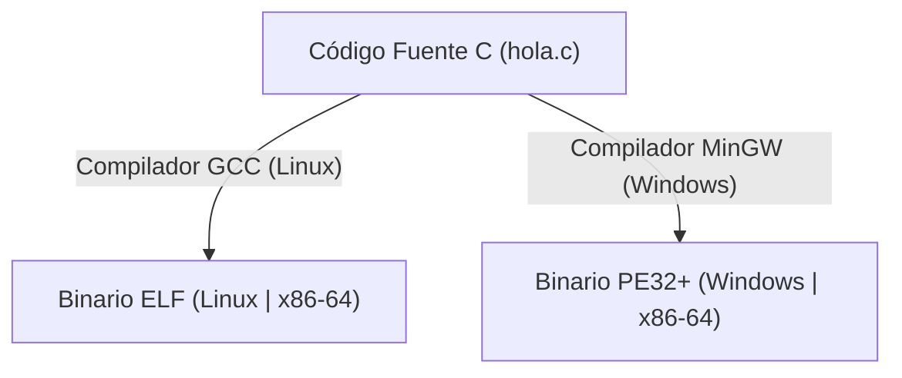
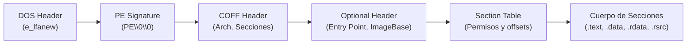
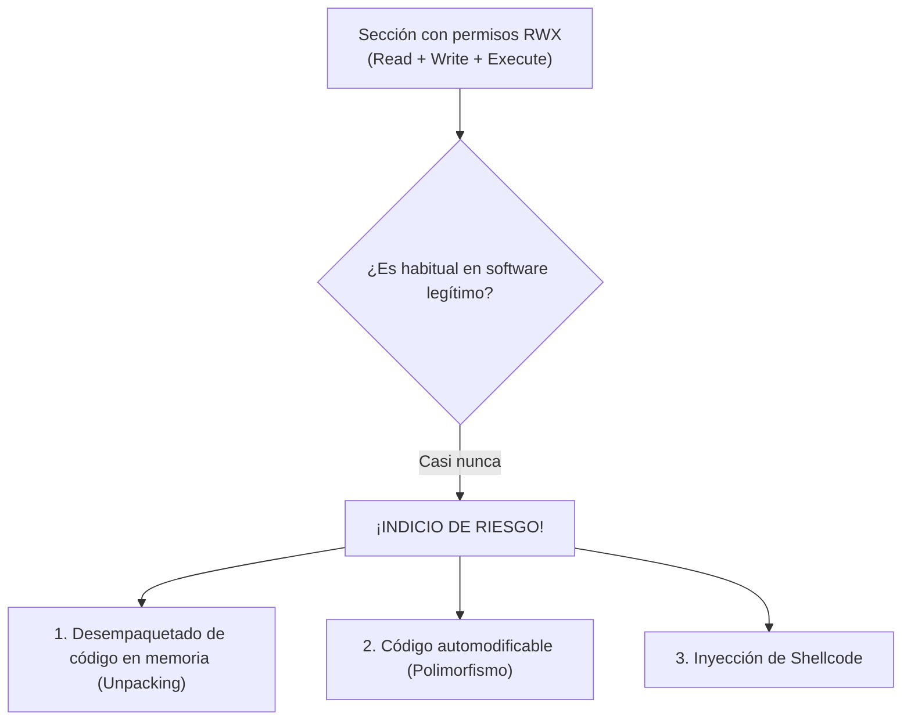
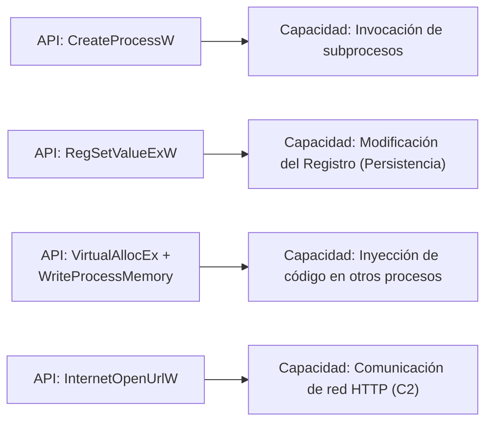

# Capítulo 04: Anatomía del Formato PE, Imports e Inferencia de Capacidades

[Inicio](../../README.md) | [Análisis de Malware](../README.md) | [Anterior: Análisis Estático Inicial](../03-analisis-estatico-inicial/README.md) | [Siguiente: Análisis Dinámico y Telemetría](../05-analisis-dinamico-y-telemetria/README.md)

| Campo | Valor |
|---|---|
| Estado | Disponible |
| Duración estimada | 4 a 5 horas |
| Nivel | Intermedio |
| Modalidad | Lectura técnica en profundidad, disección de binarios PE y uso de herramientas de ingeniería inversa |
| Prerrequisitos | Capítulos 01, 02 y 03 de Análisis de Malware |

---

## Objetivos de aprendizaje

Al finalizar este capítulo serás capaz de:

- Describir la arquitectura interna del formato **Portable Executable (PE/PE32+)** de Windows y comprender el proceso de carga en memoria.
- Analizar las cabeceras fundamentales: **DOS Header**, **PE Signature**, **COFF Header** y **Optional Header**.
- Interpretar la tabla de secciones, analizando el propósito de `.text`, `.data`, `.rdata` y `.rsrc`, e identificar la anomalía crítica de permisos **RWX**.
- Evaluar la tabla de importaciones (IAT/IDT) y reconocer familias de APIs de Windows asociadas a inyección de código, persistencia y red.
- Comprender el funcionamiento de los empaquetadores (*packers* como UPX) y utilizar la **entropía de Shannon** para detectar código comprimido o cifrado.
- Utilizar la herramienta **capa** (Mandiant) para correlacionar capacidades de binarios contra la matriz **MITRE ATT&CK**.
- Operar herramientas de inspección PE tanto en terminal (`objdump`, `readelf`) como en entornos gráficos (**PEStudio**, **Detect It Easy**, **PE-bear**).

---

## 1. El formato Portable Executable (PE): Fundamentos

El formato **PE (Portable Executable)** es el formato de archivo estándar utilizado por los sistemas operativos Microsoft Windows para ejecutables (`.exe`), bibliotecas de enlace dinámico (`.dll`), controladores de dispositivo (`.sys`) y módulos de control (`.ocx`).



> [!IMPORTANT]
> **Axioma esencial**: *El formato PE es el estándar legítimo del sistema operativo Windows; la presencia de una estructura PE no indica malicia*. Millones de programas benignos (bloc de notas, explorador, navegadores) son ejecutables PE. El analista busca **anomalías estructurales e intenciones**, no el formato en sí.

---

## 2. Anatomía detallada de un binario PE

Un archivo PE no es una masa informe de bytes; es un mapa estructurado que indica al cargador de Windows (*Windows Loader*) exactamente cómo debe proyectar el binario en la memoria virtual del proceso.

```text
ESTRUCTURA GENERAL DE UN ARCHIVO PE:
┌──────────────────────────────────────┐
│ DOS Header (Comienza con 'MZ')       │ -> Compatibilidad con MS-DOS (offset e_lfanew)
├──────────────────────────────────────┤
│ DOS Stub ("This program cannot...") │ -> Mensaje de error para modo real de 16 bits
├──────────────────────────────────────┤
│ PE Signature ('PE\0\0')              │ -> Firma de 4 bytes que confirma el formato PE
├──────────────────────────────────────┤
│ COFF File Header                     │ -> Arquitectura (x86/x64), número de secciones
├──────────────────────────────────────┤
│ Optional Header                      │ -> Entry Point, ImageBase, tamaño de imagen
├──────────────────────────────────────┤
│ Section Table (Cabeceras)            │ -> Lista de secciones y sus permisos (R, W, X)
├──────────────────────────────────────┤
│ Secciones de Datos y Código          │
│   ├── .text                          │ -> Código máquina ejecutable (instrucciones CPU)
│   ├── .rdata                         │ -> Constantes, tablas de importación (IAT)
│   ├── .data                          │ -> Variables globales inicializadas
│   └── .rsrc                          │ -> Recursos (iconos, diálogos, manifiestos)
└──────────────────────────────────────┘
```



### 2.1 DOS Header y DOS Stub
- **`e_magic`**: Los dos primeros bytes del archivo (offset `0x00`) contienen siempre los magic bytes `4D 5A` (caracteres ASCII `MZ`, iniciales de Mark Zbikowski, diseñador del formato MS-DOS).
- **`e_lfanew`**: Campo de 4 bytes situado en el offset `0x3C` que contiene la **dirección física de desplazamiento (*offset*)** donde comienza la cabecera PE real.
- **DOS Stub**: Pequeño programa de 16 bits heredado por compatibilidad que se ejecuta si el archivo se abre en un MS-DOS puro, mostrando el mensaje *"This program cannot be run in DOS mode"*.

### 2.2 PE Signature y COFF Header
- **PE Signature**: Cadena de 4 bytes `50 45 00 00` (`PE\0\0`).
- **COFF File Header**:
  - `Machine`: Define la arquitectura de destino (`0x014c` para 32-bit x86, `0x8664` para 64-bit AMD64).
  - `NumberOfSections`: Cantidad de secciones físicas que componen el binario.
  - `TimeDateStamp`: Marca de tiempo Unix de compilación (útil para telemetría, aunque los atacantes pueden falsificarla mediante *timestomping*).

### 2.3 Optional Header (Cabecera Opcional)
A pesar de su nombre histórico, esta cabecera es **estrictamente obligatoria** para los ejecutables PE:
- **`AddressOfEntryPoint`**: Dirección Virtual Relativa (RVA) donde el cargador transferirá el control de la CPU tras mapear el ejecutable en memoria.  
  *(Nota técnica: El Entry Point no coincide necesariamente con la función `main()` del código fuente; suele apuntar a código de inicialización del runtime de C/C++)*.
- **`ImageBase`**: Dirección de memoria virtual preferida donde el binario desea ser cargado (típicamente `0x00400000` en 32 bits y `0x140000000` en 64 bits, sujeta a aleatorización por ASLR).
- **`Subsystem`**: Indica si el programa es una aplicación de consola (`IMAGE_SUBSYSTEM_WINDOWS_CUI`) o con interfaz gráfica (`IMAGE_SUBSYSTEM_WINDOWS_GUI`).

---

## 3. Secciones del PE y Permisos de Memoria

Las secciones agrupan bytes con una función operativa específica y poseen directivas de protección de memoria independientes:

| Sección estándar | Contenido típico | Permisos habituales | Significado |
|---|---|---|---|
| **`.text`** | Instrucciones de código máquina (CPU opcodes). | `R-X` | Solo Lectura y Ejecución (*Read + Execute*). No debe ser modificable. |
| **`.rdata`** | Datos de solo lectura, constantes y tablas de importaciones. | `R--` | Solo Lectura (*Read Only*). |
| **`.data`** | Variables globales y estáticas que la aplicación modifica en runtime. | `RW-` | Lectura y Escritura (*Read + Write*). No ejecutable. |
| **`.rsrc`** | Recursos de la aplicación (iconos, menús, strings, binarios secundarios). | `R--` | Solo Lectura. |

### La anomalía crítica de permisos: Secciones RWX

En ingeniería de software defensiva rige el principio **W^X (*Write XOR Execute*)**: una región de memoria puede ser escribible o ejecutable, pero **nunca ambas al mismo tiempo**.



> [!WARNING]
> **Regla analítica**: La presencia de una sección con permisos **RWX** (Lectura, Escritura y Ejecución simultáneas) o nombres no estándar es una de las alertas estáticas más significativas de empaquetado o inyección en memoria.

---

## 4. Bibliotecas de Enlace Dinámico (DLL) y Tablas de Importación

Un programa en Windows no implementa desde cero todas las operaciones del sistema operativo (crear ventanas, abrir archivos, enviar paquetes de red); en su lugar, invoca funciones exportadas por **librerías DLL** del sistema.

```text
┌─────────────────────────┐                     ┌─────────────────────────┐
│       programa.exe      │                     │       KERNEL32.dll      │
│                         │   Llama a la API    │                         │
│   IMPORTA lo que        │ ──────────────────> │   EXPORTA lo que        │
│   necesita del sistema  │   GetComputerNameA  │   ofrece al sistema     │
└─────────────────────────┘                     └─────────────────────────┘
```

- **Imports (Importaciones)**: Lista de funciones de la API de Windows que el binario solicita explícitamente al sistema operativo para poder operar. Se almacenan en la **Import Directory Table (IDT)** y se resuelven en la **Import Address Table (IAT)**.

### Bibliotecas DLL fundamentales de Windows

- **`KERNEL32.dll`**: Servicios centrales del sistema (gestión de memoria, manipulación de archivos y control de procesos).
- **`ADVAPI32.dll`**: Servicios avanzados (manipulación del Registro de Windows, gestión de servicios del sistema, cuentas de usuario y criptografía).
- **`USER32.dll`**: Interfaz de usuario, ventanas y captura de eventos (teclado, ratón).
- **`WS2_32.dll`**: Sockets de red de bajo nivel (protocolos TCP/IP).
- **`WININET.dll` / `WINHTTP.dll`**: Conexiones de alto nivel HTTP, HTTPS y FTP.

### APIs sospechosas y correlación de capacidades

Examinar las APIs importadas permite formular hipótesis sobre el comportamiento que la muestra intentará desplegar:



> [!CAUTION]
> **Axioma analítico**:  
> - `String != Uso`: Que exista la palabra `"password"` no significa que la lea.  
> - `Import != Ejecución`: Que el binario importe `DeleteFileW` no demuestra que la haya ejecutado.  
> - `Capacidad != Comportamiento`: El análisis estático revela **lo que el binario puede hacer** (sus herramientas disponibles); el análisis dinámico demuestra **lo que realmente hace**.

---

## 5. Empaquetadores (*Packers*) y Entropía de la Información

Para evadir firmas estáticas y neutralizar el análisis con desensambladores, los creadores de malware emplean **empaquetadores (*packers*)**.

### ¿Cómo funciona un Packer (ej. UPX)?
1. El packer toma el ejecutable original, comprime y cifra sus secciones (`.text`, `.data`).
2. Genera un nuevo ejecutable PE que contiene los datos comprimidos en secciones nuevas (ej. `UPX0`, `UPX1`) y añade un pequeño código de descompresión denominado **Unpacking Stub**.
3. El `AddressOfEntryPoint` del nuevo binario apunta al *stub*.
4. Cuando el programa se ejecuta en la víctima, el *stub* descomprime el código original directamente en la memoria RAM y transfiere la ejecución al punto de entrada real (OEP: *Original Entry Point*).

```text
BINARIO ORIGINAL:              BINARIO EMPAQUETADO (UPX):
┌────────────────────┐         ┌───────────────────────────────┐
│ .text (Instrucciones)│         │ UPX0 (Espacio vacío para RAM) │
├────────────────────┤   UPX   ├───────────────────────────────┤
│ .data (Variables)  │ ──────> │ UPX1 (Código original CIFRADO)│
├────────────────────┤         ├───────────────────────────────┤
│ Strings visibles   │         │ Unpacking Stub (Punto entrada)│
└────────────────────┘         └───────────────────────────────┘
                                 * Desaparecen strings e imports
```

### Entropía de Shannon: Midiendo el desorden de los datos
La **entropía** (teoría de la información de Claude Shannon) mide el grado de aleatoriedad o desorden en una secuencia de bytes en una escala de **0.0 a 8.0**:
- **Texto plano o código regular**: Presenta alta predictibilidad y patrones repetidos (entropía típica entre **4.0 y 6.0**).
- **Código comprimido o cifrado**: Presenta una distribución prácticamente uniforme de bytes, sin patrones reconocibles (entropía elevada entre **7.2 y 8.0**).

```text
TRÍADA DE DIAGNÓSTICO DE EMPAQUETADO (PACKING):
1. Muy pocas cadenas de texto legibles extraídas con strings.
2. Nombres de secciones atípicos (UPX0, UPX1, .aspack, MEW) o secciones con permisos RWX.
3. Tabla de importaciones diminuta: el binario casi no importa APIs, salvo LoadLibraryA
   y GetProcAddress (necesarias para que el stub cargue librerías en memoria).
4. Entropía superior a 7.2 en una o más secciones.
```

> [!NOTE]
> **Aviso de madurez**: *Packed $\neq$ Malware*. Numerosas soluciones de software comercial, videojuegos y herramientas empresariales utilizan empaquetadores y protectores (Themida, VMProtect) para proteger secretos comerciales o propiedad intelectual contra la piratería.

---

## 6. Inferencia asistida con `capa` (Mandiant)

La herramienta **`capa`** automatiza la identificación de capacidades técnicas en ejecutables PE mediante un repositorio abierto de reglas basadas en firmas y patrones de ensamblador, mapeando los hallazgos directamente a la matriz **MITRE ATT&CK**:

```bash
capa muestra.exe
```

Ejemplo conceptual de salida de `capa`:
```text
+------------------------+-------------------------------------------------------+
| ATT&CK Tactic          | ATT&CK Technique                                      |
|------------------------+-------------------------------------------------------|
| DEFENSE EVASION        | Obfuscated Files or Information [T1027]               |
| DISCOVERY              | System Information Discovery [T1082]                  |
| EXECUTION              | Command and Scripting Interpreter::PowerShell [T1059] |
+------------------------+-------------------------------------------------------+

[+] Discovery
  [-] get system hostname
      matched: GetComputerNameA at 0x140001050
```

### Automatizar sin delegar el criterio
`capa` es un acelerador de triaje formidable, pero el analista nunca debe copiar su salida a ciegas:
- Si `capa` señala *"Persistencia en Registro"*, pero la única evidencia es una cadena literal aislada de `CurrentVersion\Run` sin llamadas a la API `RegSetValueExA`, se trata de una **hipótesis no confirmada**, no de una capacidad demostrada.

---

## 7. Herramientas gráficas de inspección (FLARE-VM)

Una vez dominados los fundamentos en línea de comandos, el analista opera herramientas visuales que consolidan la información:

```text
SUITE GRÁFICA DE ANÁLISIS PE:
├── Detect It Easy (DIE) -> Detección instantánea de compilador, empaquetador y gráfico de entropía
├── PEStudio             -> Detección de banderas anómalas, APIs sospechosas, virustotal score y strings
└── PE-bear              -> Inspección y edición visual lado a lado de cabeceras, RVA, IAT y secciones
```

---

## Preguntas de autoevaluación

1. ¿Por qué es un error afirmar que un archivo ejecutable es malicioso únicamente porque tiene formato PE?
2. Explica la función técnica de los campos `e_magic` y `e_lfanew` dentro del DOS Header.
3. ¿Cuál es el propósito del campo `AddressOfEntryPoint` en el Optional Header y por qué no coincide necesariamente con la función `main()`?
4. ¿Por qué una sección de memoria con permisos **RWX** representa una señal de alerta de máxima prioridad durante el triaje estático?
5. ¿Qué cuatro características técnicas (la tríada de diagnóstico) permiten sospechar de forma concluyente que un binario ha sido empaquetado con un packer como UPX?
6. Si un ejecutable importa únicamente `LoadLibraryA` y `GetProcAddress`, ¿qué deducción analítica sobre el funcionamiento del binario podemos formular?

---

[Anterior: Análisis Estático Inicial](../03-analisis-estatico-inicial/README.md) | [Volver al Índice de Análisis de Malware](../README.md) | [Siguiente: Análisis Dinámico y Telemetría](../05-analisis-dinamico-y-telemetria/README.md)
