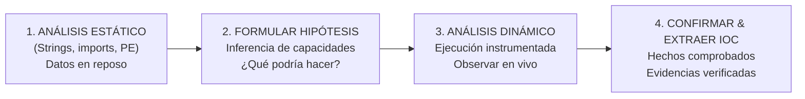
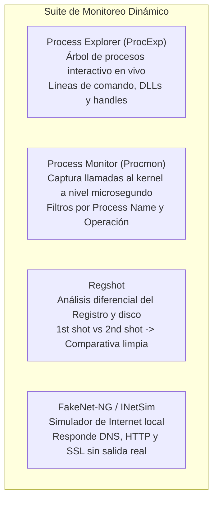

# Capítulo 05: Análisis Dinámico, Telemetría y Extracción de IOCs

[Inicio](../../README.md) | [Análisis de Malware](../README.md) | [Anterior: Formato PE y Capacidades](../04-formato-pe-y-capacidades/README.md)

| Campo | Valor |
|---|---|
| Estado | Disponible |
| Duración estimada | 4 a 5 horas |
| Nivel | Intermedio |
| Modalidad | Lectura técnica, detonación controlada en sandbox y extracción forense de telemetría |
| Prerrequisitos | Capítulos 01 a 04 de Análisis de Malware |

---

## Objetivos de aprendizaje

Al finalizar este capítulo serás capaz de:

- Comprender la transición metodológica del análisis estático (generación de hipótesis en disco) al análisis dinámico (verificación empírica en memoria y tiempo real).
- Dominar los **cuatro pilares de telemetría**: árbol de procesos, sistema de archivos, registro del sistema y comunicaciones de red.
- Configurar y aplicar la metodología de 9 pasos para la detonación controlada de artefactos binarios.
- Operar con precisión las suites de monitoreo en Windows: **Process Monitor (Procmon)**, **Process Explorer (ProcExp)** y **Regshot**.
- Simular servicios de infraestructura de red sin exponer la máquina a Internet mediante **FakeNet-NG** e **INetSim**.
- Estructurar e interpretar comparativas diferenciales de claves de registro y archivos soltados (*dropped files*).
- Sintetizar los hallazgos dinámicos en **Indicadores de Compromiso (IOCs)** procesables para equipos defensivos (Blue Team y SOC).
- Aplicar la metodología en laboratorios prácticos basados en escenarios reales (misión *Egg-xecutable*).

---

## 1. Fundamentos del análisis dinámico: De la hipótesis al hecho

El **análisis dinámico** (también conocido como análisis conductual o *behavioral analysis*) consiste en ejecutar la muestra sospechosa dentro de un entorno confinado, instrumentado y descartable (*sandbox*) para registrar, correlacionar y analizar su comportamiento en tiempo real.



### La sinergia indispensable entre estático y dinámico
- El análisis estático genera las **preguntas e hipótesis de riesgo** a partir de los datos observables en disco (ej. APIs detectadas, cadenas sospechosas).
- El análisis dinámico aporta las **respuestas con hechos**: comprueba si esas hipótesis se materializan, captura los archivos secundarios que se descargan o crean, y registra las claves exactas donde el malware se afianza.

---

## 2. Los cuatro pilares de telemetría del sistema

Durante la detonación de una muestra, el analista monitoriza cuatro dimensiones fundamentales del sistema operativo:

```text
LOS 4 PILARES DE TELEMETRÍA DINÁMICA:
┌─────────────────────────┬────────────────────────────────────────────────────────┐
│ Pilar de Telemetría     │ Eventos observados y herramientas de captura          │
├─────────────────────────┼────────────────────────────────────────────────────────┤
│ 1. Procesos y Memoria   │ Invocación de subprocesos (cmd.exe, powershell.exe),  │
│                         │ inyección de DLLs en procesos legítimos, hilos huérfanos.│
│                         │ Herramientas: Process Explorer (ProcExp), Procmon.      │
├─────────────────────────┼────────────────────────────────────────────────────────┤
│ 2. Sistema de Archivos  │ Archivos soltados (dropped files), scripts temporales  │
│                         │ en %TEMP% o C:\Users\Public, eliminación de evidencias.│
│                         │ Herramientas: Process Monitor (Procmon), Explorer.     │
├─────────────────────────┼────────────────────────────────────────────────────────┤
│ 3. Registro de Windows  │ Persistencia en claves Run/RunOnce, creación de        │
│                         │ servicios del sistema, alteración de políticas de UAC. │
│                         │ Herramientas: Regshot, Process Monitor.                │
├─────────────────────────┼────────────────────────────────────────────────────────┤
│ 4. Red y Comunicaciones │ Consultas DNS solicitadas, conexiones salientes HTTP, │
│                         │ balizas (beacons) hacia servidores de C2.              │
│                         │ Herramientas: FakeNet-NG, INetSim, Wireshark.          │
└─────────────────────────┴────────────────────────────────────────────────────────┘
```

---

## 3. Herramientas esenciales de monitoreo dinámico (FLARE-VM)

Para instrumentar el sistema operativo Windows durante la detonación, se emplean herramientas especializadas:



### 3.1 Process Monitor (Procmon - Sysinternals)
Captura en tiempo real todas las llamadas al kernel de Windows relacionadas con el sistema de archivos, el registro, procesos y subprocesos.
- **El reto**: Procmon captura fácilmente más de 100,000 eventos por segundo de la actividad normal del sistema. **Saber filtrar es la habilidad esencial del analista**.
- **Filtros indispensables**:
  1. `Process Name is sample.exe -> Include` (acota los eventos al binario detonado).
  2. `Operation is Process Create -> Include` (detecta si la muestra invoca comandos ocultos o consolas).
  3. `Operation is RegSetValue -> Include` (identifica valores escritos en el registro para persistencia).
  4. `Operation is CreateFile -> Include` (identifica archivos creados en disco).

### 3.2 Process Explorer (ProcExp - Sysinternals)
Proporciona un Administrador de Tareas avanzado con visualización jerárquica en árbol:
- Muestra las relaciones **padre $\rightarrow$ hijo** (ejemplo: si `sample.exe` engendra un proceso `cmd.exe /c powershell.exe -enc...`).
- Resalta procesos nuevos en verde y procesos que terminan en rojo.
- Permite examinar las cadenas de texto del proceso **directamente desde la memoria RAM** (descartando empaquetadores como UPX que ya se hayan desempaquetado).

### 3.3 Regshot: La técnica diferencial del Registro
Muchas muestras añaden claves de persistencia en el Registro de Windows en cuestión de milisegundos. Regshot permite capturar este cambio con precisión quirúrgica:
1. **1st shot**: Toma una foto completa del estado limpio del registro y del sistema de archivos.
2. **Detonación**: Se ejecuta la muestra y se le permite actuar durante 2 a 5 minutos.
3. **2nd shot**: Toma una segunda foto del estado tras la infección.
4. **Compare**: Compara ambos estados y genera un informe de texto que lista exactamente qué claves, valores y archivos fueron agregados, modificados o eliminados.

### 3.4 Simulación de red con FakeNet-NG
Si un malware no detecta conectividad a Internet, puede suspender su ejecución o no desplegar sus capacidades finales. Sin embargo, no podemos conectarlo a Internet real por seguridad.
- **FakeNet-NG** intercepta todo el tráfico de red de la máquina virtual local y responde de forma simulada:
  - Si el malware solicita una resolución DNS para `c2-malicioso.com`, FakeNet responde con `127.0.0.1`.
  - Si realiza una petición `HTTP GET /payload.exe`, FakeNet devuelve un archivo ejecutable sintético inofensivo.
  - Registra todos los dominios, URLs y cabeceras solicitadas en un archivo de log.

---

## 4. El flujo metodológico de 9 pasos para el análisis dinámico

Para obtener resultados reproducibles y garantizar la integridad del laboratorio, el analista sigue rigurosamente esta secuencia:

```text
[ 1. Revertir Snapshot ] ───> [ 2. Triage Estático ] ───> [ 3. Formular Hipótesis ]
   Restaurar BASE-LIMPIA         PeStudio: hashes/imports    Predecir conductas y rutas
            │                                                          │
            ▼                                                          ▼
[ 6. Observar en Vivo ]  <─── [ 5. Ejecutar Muestra ] <─── [ 4. Iniciar Monitoreo ]
   ProcExp: árbol e hijos        Detonación controlada        Regshot 1st shot + Procmon
            │
            ▼
[ 7. Comparar Cambios ]  ───> [ 8. Extraer IOCs ]    ───> [ 9. Restaurar la VM ]
   Regshot 2nd shot + diff       Formalizar indicadores      Revertir a BASE-LIMPIA
```

---

## 5. Ejemplo práctico: De la hipótesis al hallazgo verificado

Veamos cómo se articulan las fases en un escenario analítico real:

```mermaid
flowchart TD
    subgraph 1. Triage Estático Previo (PeStudio)
        S1["APIs importadas: CreateFileW, RegSetValueExW, CreateProcessW"]
        S2["Strings observadas: 'update.exe', 'CurrentVersion\\Run'"]
    end
    
    subgraph 2. Hipótesis Formuladas
        H1["Hipótesis 1: El malware creará un ejecutable auxiliar llamado update.exe"]
        H2["Hipótesis 2: Fijará inicio automático en el Registro de Windows"]
        H3["Hipótesis 3: Lanzará un subproceso powershell para ejecutar comandos"]
    end
    
    subgraph 3. Telemetría Real Verificada (Análisis Dinámico)
        T1["Procmon: CreateFile C:\\Users\\Public\\update.exe (Confirmado)"]
        T2["Regshot: Entrada añadida en HKCU\\...\\Run\\Updater = C:\\Users\\Public\\update.exe"]
        T3["ProcExp: Proceso powershell.exe engendrado con argumento -enc (Base64)"]
    end
    
    S1 & S2 --> H1 & H2 & H3
    H1 & H2 & H3 --> T1 & T2 & T3
```

> [!TIP]
> **Conclusión del caso**: El análisis dinámico transformó las sospechas e hipótesis estáticas en **evidencias confirmadas e Indicadores de Compromiso (IOCs) reproducibles y accionables**.

---

## 6. Formalización y documentación de Indicadores de Compromiso (IOC)

El entregable primordial de un analista de malware para el equipo de respuesta a incidentes y el SOC es la **Ficha de Indicadores de Compromiso (IOC)**:

```text
FICHA DE INDICADORES DE COMPROMISO (IOC) - FORMATO FORENSE:
┌──────────────┬─────────────────────────────────────────────────────────────────┐
│ Tipo de IOC  │ Valor técnico exacto y Contexto operativo                       │
├──────────────┼─────────────────────────────────────────────────────────────────┤
│ Hash SHA-256 │ a3f5b8c9d1e2f3... (Muestra principal entregada por phishing)    │
│ Hash SHA-256 │ e7c19d4b8a2f0e... (Archivo auxiliar update.exe soltado en disco)│
│ Ruta (Drop)  │ C:\Users\Public\update.exe                                      │
│ Registro     │ HKCU\Software\Microsoft\Windows\CurrentVersion\Run\Updater      │
│ Red (Dominio)│ update.dominio-malicioso.com (Puerto 443/TCP)                   │
│ Red (IP C2)  │ 198.51.100.42 (Servidor C2 de comando y control)               │
│ Proceso      │ powershell.exe -ExecutionPolicy Bypass -enc ...                 │
└──────────────┴─────────────────────────────────────────────────────────────────┘
```

---

## Laboratorio Práctico Guiado: Misión "Egg-xecutable"

Para ejercitar este flujo completo en un escenario interactivo de aprendizaje (inspirado en salas de análisis de malware como TryHackMe o laboratorios en FLARE-VM):

### Secuencia de la misión
1. **Línea Base**: Asegúrate de que la VM está en su snapshot limpio. Inicia Regshot y toma el `1st shot`.
2. **Armado de Telemetría**: Abre Process Monitor, borra el búfer actual (`Ctrl + X`) y activa la captura (`Ctrl + E`). Abre Process Explorer en paralelo.
3. **Detonación**: Ejecuta la muestra sospechosa en el escritorio.
4. **Observación en Vivo**: En Process Explorer, identifica si la muestra sigue activa, si ha engendrado procesos hijos o si ha desaparecido tras inyectarse en otro proceso del sistema.
5. **Captura Diferencial**: En Regshot, toma el `2nd shot` y pulsa `Compare`. Examina el archivo de texto generado.
6. **Filtrado en Procmon**: Filtra por el nombre de la muestra y por la operación `CreateFile`. Localiza qué archivo secundario fue creado (el "huevo" o payload droppeado).

### Checklist operativo del analista

```text
CHECKLIST OPERATIVO EN EL LABORATORIO:
[ ] ¿Confirmaste que la VM está en red aislada o con FakeNet activo antes de detonar?
[ ] ¿Tomaste el 1st shot en Regshot antes de abrir la muestra?
[ ] ¿Configuraste el filtro en Procmon por el nombre del proceso objetivo?
[ ] ¿Identificaste la ruta exacta y el hash del archivo droppeado en disco?
[ ] ¿Identificaste la clave de registro utilizada para mantener persistencia?
[ ] ¿Revertiste la máquina virtual a su snapshot BASE-LIMPIA tras documentar los hallazgos?
```

```text
LEMA RECTOR DEL ANÁLISIS DINÁMICO:
Observe  ───>  Execute  ───>  Monitor  ───>  Compare  ───>  Identify IOC
```

---

## Preguntas de autoevaluación

1. ¿Por qué el análisis estático y el análisis dinámico son metodologías complementarias y no sustitutivas?
2. Explica el funcionamiento del procedimiento diferencial con **Regshot** (1st shot vs 2nd shot) y por qué es superior a revisar manualmente el registro de Windows.
3. ¿Cuál es el riesgo de detonar una muestra de malware en una máquina virtual que tiene configurado el adaptador de red en modo *NAT*?
4. Si un analista abre Process Monitor sin configurar filtros, ¿con qué problema se encontrará y qué tres filtros esenciales debe aplicar de inmediato?
5. ¿Qué función cumple una herramienta como **FakeNet-NG** durante el análisis dinámico y qué ventaja aporta frente a desconectar el cable de red virtual por completo?
6. Enumera los cuatro pilares de telemetría dinámica y menciona un artefacto representativo de cada uno.

---

[Anterior: Formato PE y Capacidades](../04-formato-pe-y-capacidades/README.md) | [Volver al Índice de Análisis de Malware](../README.md)
