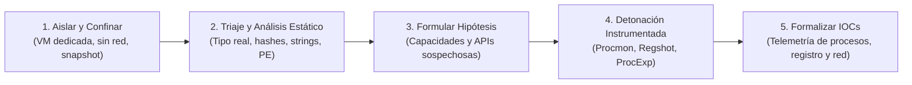

# Análisis de Malware: Guía Práctica de Ingeniería Inversa y Telemetría Forense

[Inicio](../README.md) | [Configurar laboratorio](../setup/README.md)

Un recurso técnico abierto y estructurado como libro de aprendizaje para comprender la anatomía del software malicioso, dominar el análisis estático y dinámico en entornos confinados, diseccionar ejecutables PE y extraer indicadores de compromiso (IOC) verificados sin poner en riesgo la infraestructura anfitriona.

> [!CAUTION]
> **Alcance y Seguridad Operativa**: El material, código y laboratorios descritos en este recurso tienen fines estrictamente pedagógicos, defensivos y de investigación de seguridad. Las técnicas deben ejecutarse exclusivamente en máquinas virtuales aisladas (red Host-Only o Red Interna), sin salida a redes reales y siguiendo el ciclo disciplinado de restauración de snapshots. El autor no se responsabiliza del uso indebido de los conceptos expuestos.

---

## Prólogo y Filosofía: "Observar, Aislar y Explicar"

El análisis de malware no se basa en conjeturas ni en la ejecución desordenada de herramientas automáticas. Representa una disciplina forense y científica que transforma un binario desconocido en **inteligencia técnica procesable, reproducible y fundamentada empíricamente**.

Este libro digital se rige por la metodología:



---

## Roadmap de Estudio

```mermaid
mindmap
  root((Análisis de Malware))
    Capítulo 01: Fundamentos y Taxonomía
      Concepto de Malware y Tríada
      Vocabulario de Infección
      Taxonomía Multidimensional
      Casos Históricos: CIH, Emotet, Mirai
      Caso Profundo: WannaCry y Kill Switch
    Capítulo 02: Entornos Seguros
      Reglas de Confinamiento de VM
      Modos de Red y Peligros de Bridge
      Snapshots y Ciclo Limpio
      Manejo Seguro en ZIP Cifrado
      OPSEC en Servicios Cloud
    Capítulo 03: Análisis Estático Inicial
      Magic Bytes y Tipo Real
      Hashes SHA-256 y Avalancha
      Extracción y Filtro de Strings
      Cadenas Ofuscadas con FLOSS
      Ficha Técnica de Triaje
    Capítulo 04: Formato PE y Capacidades
      Cabeceras DOS, PE y COFF
      Secciones y Permisos RWX
      Imports y APIs Críticas
      Packers (UPX) y Entropía
      Mapeo ATT&CK con capa
    Capítulo 05: Análisis Dinámico
      Cuatro Pilares de Telemetría
      Metodología de 9 Pasos
      Monitoreo con Procmon y ProcExp
      Diferencial de Registro con Regshot
      Extracción de IOCs y Laboratorio
```

---

## Tabla de Contenidos (Índice de Capítulos)

| # | Capítulo | Descripción técnica | Duración | Nivel | Práctica / Lab | Estado |
|---|---|---|---|---|---|---|
| **01** | [**Fundamentos del Malware, Taxonomía y Rol del Analista**](./01-fundamentos-y-taxonomia/README.md) | Tríada conceptual (Vulnerabilidad vs Exploit vs Malware), etapas de infección (stager, dropper, payload), modelo multidimensional de 4 ejes, casos emblemáticos (CIH, Emotet, RedLine, Mirai), caso WannaCry a fondo y método científico. | 3 - 4 h | Inicial | Análisis de casos históricos y clasificación | **Disponible** |
| **02** | [**Entornos de Análisis Seguro y Manejo de Muestras**](./02-entornos-seguros-y-laboratorio/README.md) | Protocolo de confinamiento, topologías de red virtual (aislamiento Host-Only e Internal), gestión del snapshot `BASE-LIMPIA`, contenedores ZIP con contraseña (`infected`), plataformas REMnux/FLARE-VM y riesgos de OPSEC en VirusTotal. | 3 - 4 h | Inicial | Verificación de aislamiento en VM | **Disponible** |
| **03** | [**Análisis Estático Inicial y Extracción de Artefactos**](./03-analisis-estatico-inicial/README.md) | Inspección sin ejecución, detección de extensiones falsas mediante Magic Bytes (ELF vs PE), correlación y efecto avalancha con SHA-256, cadenas ASCII/Unicode, recuperación con FLOSS, `objdump` y ficha de triaje. | 3 - 4 h | Inicial - Intermedio | [Laboratorio con muestra C](./03-analisis-estatico-inicial/lab/) | **Disponible** |
| **04** | [**Anatomía del Formato PE, Imports e Inferencia de Capacidades**](./04-formato-pe-y-capacidades/README.md) | Estructura interna de ejecutables de Windows (DOS Header, COFF, Optional Header), tabla de secciones y anomalía de permisos RWX, análisis de IAT y APIs sospechosas, empaquetadores (UPX), entropía de Shannon y reglas con `capa`. | 4 - 5 h | Intermedio | Inspección de PE y cálculo de entropía | **Disponible** |
| **05** | [**Análisis Dinámico, Telemetría y Extracción de IOCs**](./05-analisis-dinamico-y-telemetria/README.md) | Detonación controlada, los 4 pilares de telemetría (procesos, sistema de archivos, registro y red), flujo metodológico de 9 pasos, uso avanzado de Procmon, ProcExp y Regshot, simulación con FakeNet-NG y misión Egg-xecutable. | 4 - 5 h | Intermedio | Laboratorio dinámico e informe de IOCs | **Disponible** |

---

## Matriz de Cobertura MITRE ATT&CK

| Táctica MITRE ATT&CK | Identificador | Técnica / Capacidad cubierta | Capítulo |
|---|---|---|---|
| **Execution** | T1059 | Command and Scripting Interpreter (PowerShell / cmd) | [Capítulo 03](./03-analisis-estatico-inicial/README.md), [Capítulo 05](./05-analisis-dinamico-y-telemetria/README.md) |
| **Persistence** | T1547.001 | Boot or Logon Autostart Execution: Registry Run Keys | [Capítulo 04](./04-formato-pe-y-capacidades/README.md), [Capítulo 05](./05-analisis-dinamico-y-telemetria/README.md) |
| **Defense Evasion** | T1027 | Obfuscated Files or Information (Empaquetado UPX / Cifrado) | [Capítulo 03](./03-analisis-estatico-inicial/README.md), [Capítulo 04](./04-formato-pe-y-capacidades/README.md) |
| **Defense Evasion** | T1036 | Masquerading: Extensiones engañosas y nombres legítimos | [Capítulo 03](./03-analisis-estatico-inicial/README.md) |
| **Discovery** | T1082 | System Information Discovery (`GetComputerNameA`) | [Capítulo 04](./04-formato-pe-y-capacidades/README.md) |
| **Credential Access** | T1555 | Credentials from Password Stores (Navegadores / RedLine) | [Capítulo 01](./01-fundamentos-y-taxonomia/README.md), [Capítulo 03](./03-analisis-estatico-inicial/README.md) |
| **Command and Control** | T1071 | Application Layer Protocol (Comunicaciones C2 web) | [Capítulo 01](./01-fundamentos-y-taxonomia/README.md), [Capítulo 05](./05-analisis-dinamico-y-telemetria/README.md) |
| **Impact** | T1486 | Data Encrypted for Impact (Ransomware / WannaCry) | [Capítulo 01](./01-fundamentos-y-taxonomia/README.md) |

---

## Preparación del Entorno de Prácticas

Para seguir los laboratorios de esta ruta formativa:
1. Consulta los requisitos de hardware y virtualización en la [Guía de Configuración del Laboratorio](../setup/README.md).
2. Para **Análisis Estático (Capítulos 01 a 04)**: Utiliza una máquina virtual Linux (REMnux, Kali Linux o Ubuntu) con GCC y binutils instalados:
   ```bash
   sudo apt update && sudo apt install -y build-essential binutils file xxd
   ```
3. Para **Análisis Dinámico (Capítulo 05)**: Configura una máquina virtual Windows 10/11 en modo Host-Only con las herramientas de telemetría de Sysinternals (**Procmon**, **Process Explorer**) y **Regshot**.

---

## Cómo Progresar a través del Libro

1. Estudia los capítulos en orden progresivo comenzando por el [Capítulo 01](./01-fundamentos-y-taxonomia/README.md).
2. Completa las preguntas de autoevaluación al final de cada capítulo para validar tu asimilación conceptual.
3. Configura tu máquina virtual aislada con el checklist del [Capítulo 02](./02-entornos-seguros-y-laboratorio/README.md).
4. Ejecuta el [Laboratorio de Análisis Estático](./03-analisis-estatico-inicial/lab/README.md) con la muestra simulada provista.
5. Practica la telemetría dinámica y la generación de fichas de IOC en el [Capítulo 05](./05-analisis-dinamico-y-telemetria/README.md).

[Volver al Catálogo Principal del Repositorio](../README.md)
