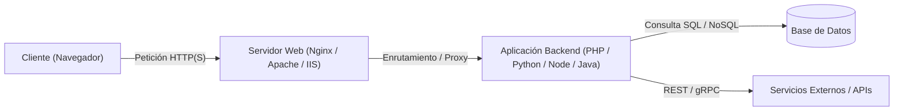
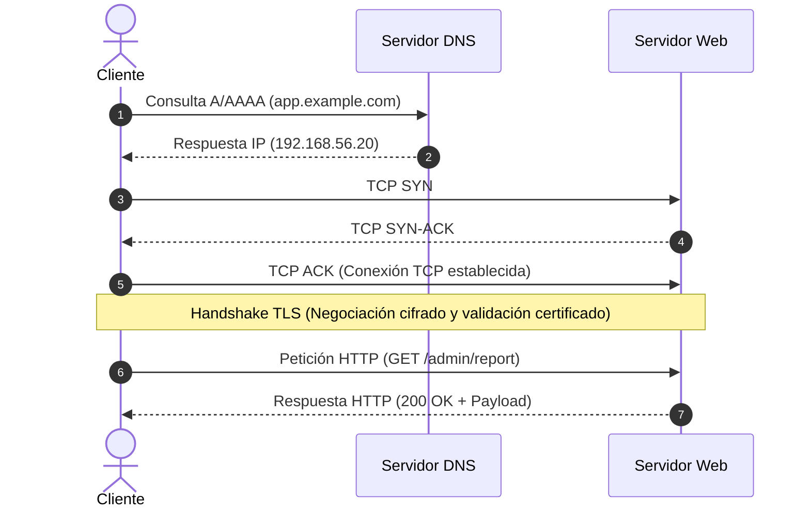
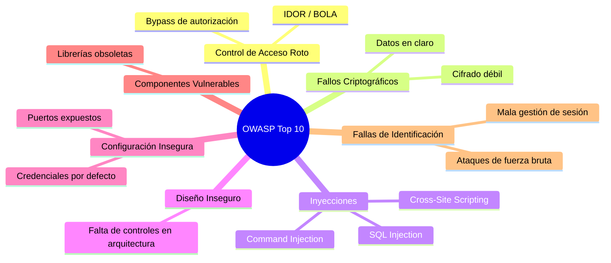

# Capítulo 01: Arquitectura Web y Protocolo HTTP

[Inicio](../../README.md) | [Pentesting Web](../README.md) | [Siguiente: Fundamentos de SQL](../02-fundamentos-sql/README.md)

| Campo | Valor |
|---|---|
| Estado | Disponible |
| Duración estimada | 3 a 4 horas |
| Nivel | Inicial |
| Modalidad | Lectura teórica exhaustiva y prácticas con terminal/DevTools |
| Prerrequisitos | Conceptos básicos de redes y manejo de terminal Linux |

---

## Objetivos de aprendizaje

Al finalizar este capítulo serás capaz de:

- Describir con precisión el modelo cliente-servidor web y justificar por qué el navegador nunca representa una frontera de confianza.
- Desglosar los componentes de una URL según el estándar RFC 3986 e identificar vectores de entrada en cada fragmento.
- Trazar el ciclo de vida completo de una petición web, desde la resolución DNS y negociación TCP/TLS hasta la transacción HTTP.
- Analizar la estructura de mensajes de petición y respuesta HTTP, interpretando cabeceras, códigos de estado y cuerpos en distintos formatos.
- Diferenciar rigurosamente entre formateo, codificación y cifrado, evaluando el impacto de cada concepto en auditorías de seguridad.
- Comprender el ciclo de vida de una sesión web y auditar la configuración de seguridad de las cookies (`Secure`, `HttpOnly`, `SameSite`).
- Explicar el funcionamiento de un proxy de interceptación y el mecanismo MitM mediante certificados CA locales para inspeccionar tráfico HTTPS.

---

## 1. El modelo de aplicaciones web

Una aplicación web moderna no es un sistema monolítico aislado; es una arquitectura distribuida donde interactúan múltiples subsistemas a través de redes públicas y privadas.



### Componentes de la arquitectura

1. **Cliente (Frontend / Navegador)**:
   - Ejecuta HTML, CSS y JavaScript en la máquina del usuario final.
   - Su propósito es renderizar la interfaz gráfica, recopilar entradas del usuario y enviar peticiones estructuradas al servidor.
   - **Propiedad fundamental**: El cliente es un entorno enteramente hostil y controlado por el usuario.

2. **Servidor Web (Web Server)**:
   - Software encargado de escuchar en los puertos de red (habitualmente 80/TCP para HTTP y 443/TCP para HTTPS), gestionar el protocolo TLS, servir recursos estáticos (imágenes, hojas de estilo, scripts) y delegar peticiones dinámicas al backend mediante protocolos como FastCGI, WSGI o proxies inversos.
   - Ejemplos: Apache HTTP Server, Nginx, Microsoft IIS, Caddy.

3. **Backend / Servidor de Aplicaciones**:
   - Capa lógica donde residen las reglas de negocio, la autenticación, la autorización y el procesamiento transaccional.
   - Se comunica con las bases de datos y servicios auxiliares (colas de mensajería, cachés, APIs de terceros).
   - Tecnologías comunes: PHP, Python (Django/FastAPI), Node.js (Express/Nest), Java (Spring Boot), C# (.NET Core), Go, Ruby.

4. **Base de Datos y Servicios de Soporte**:
   - Motores relacionales (MariaDB, MySQL, PostgreSQL, Oracle) o no relacionales (MongoDB, Redis) que almacenan de forma persistente la información crítica (credenciales, perfiles, transacciones).
   - **Regla técnica**: El navegador cliente nunca dialoga directamente con la base de datos; cualquier interacción ocurre mediada por el backend en nombre del usuario autenticado.

---

## 2. Fronteras de confianza: El cliente no es una autoridad

Uno de los principios cardinales en seguridad de aplicaciones web es el concepto de **frontera de confianza** (*Trust Boundary*).

```text
[ ENTORNO NO CONFIABLE ]                     [ ENTORNO CONFIABLE ]
    Navegador / Cliente                             Servidor
+--------------------------+               +--------------------------+
| - HTML / CSS             |   HTTP(S)     | - Lógica de negocio      |
| - JavaScript             | ------------> | - Autenticación          |
| - Validaciones en form   |               | - Autorización por roles |
| - Almacenamiento local   |               | - Consultas a BD         |
+--------------------------+               +--------------------------+
     (Totalmente manipulable)                     (Punto único de control)
```

> [!CAUTION]
> **Axioma de Pentesting Web**: Las validaciones en el frontend existen únicamente para mejorar la experiencia de usuario (UX) reduciendo latencia ante errores tipográficos. **Nunca deben considerarse controles de seguridad**.

Cualquier restricción implementada en el cliente puede neutralizarse trivialmente:
- Desactivar JavaScript en el navegador.
- Modificar el DOM mediante las Herramientas de Desarrollador (F12) para eliminar atributos `disabled`, `maxlength`, `required` o cambiar campos `type="hidden"`.
- Alterar la petición en tránsito utilizando un proxy de interceptación antes de que llegue al servidor.
- Reconstruir la petición HTTP directamente mediante herramientas de línea de comandos como `curl` o bibliotecas de scripts (Python `requests`).

Por tanto, **toda decisión crítica de seguridad (identidad, permisos sobre el recurso, balance de saldo, precios) debe validarse estrictamente en el backend**.

---

## 3. Anatomía de una URL (RFC 3986)

Un Localizador Uniforme de Recursos (URL) es una cadena de caracteres estructurada que define la ubicación de un recurso y el protocolo para acceder a él.

```text
https://app.example.com:8443/admin/report?id=42&format=pdf#resumen
\___/   \_____________/ \__/ \__________/ \______________/ \_____/
  |            |          |        |              |           |
Esquema       Host      Puerto    Ruta       Query String  Fragmento
```

| Componente | Ejemplo | Función técnica | Relevancia en Pentesting |
|---|---|---|---|
| **Esquema (Scheme)** | `https` | Define el protocolo de transporte a emplear (`http`, `https`, `ftp`). | Determina si el canal va cifrado con TLS (`https`) o en texto plano (`http`). |
| **Host** | `app.example.com` | Nombre de dominio calificado (FQDN) o dirección IP que identifica el servidor de destino. | Determina la resolución DNS y el contenido de la cabecera `Host` (crucial para ataques de *Virtual Host routing*). |
| **Puerto** | `:8443` | Puerto TCP de escucha del servicio. Si se omite, se asume el estándar (80 para HTTP, 443 para HTTPS). | Servicios en puertos no estándar pueden eludir filtros perimetrales o indicar paneles administrativos internos. |
| **Ruta (Path)** | `/admin/report` | Ubicación lógica del endpoint o recurso solicitado dentro de la jerarquía del servidor. | Superficie para ataques de Path Traversal (`../`), bypass de control de acceso y enumeración de endpoints ocultos. |
| **Query String** | `?id=42&format=pdf` | Conjunto de parámetros expresados en pares `clave=valor`, delimitados entre sí por `&` e iniciados por `?`. | Vector directo de inyecciones (SQLi, XSS, SSRF, LFI) y manipulación de parámetros de negocio (IDOR). |
| **Fragmento** | `#resumen` | Identificador interno de posición dentro del documento renderizado; **no se transmite al servidor**. | Utilizado por aplicaciones de una sola página (SPA) y vulnerable a ataques de *DOM-based XSS*. |

---

## 4. De la URL a la conexión: El ciclo de red

Cuando un cliente solicita una URL en su navegador, ocurren cuatro etapas secuenciales antes de transferir datos de la aplicación:



1. **Resolución DNS**: El sistema operativo consulta su caché local, el archivo `hosts` y los servidores DNS configurados para traducir el nombre de dominio en una dirección IP accesible.
2. **Establecimiento de sesión TCP (3-way Handshake)**:
   - El cliente envía un paquete con bandera `SYN`.
   - El servidor responde con `SYN-ACK`.
   - El cliente confirma con `ACK`. A partir de este momento existe un canal bidireccional fiable sobre TCP.
3. **Negociación TLS (Transport Layer Security)**:
   - En conexiones HTTPS, se intercambian las versiones de protocolo y suites criptográficas soportadas (*Client Hello / Server Hello*).
   - El servidor presenta su certificado digital X.509 para validar su identidad ante el cliente.
   - Se establece una clave de sesión simétrica temporal (ej. mediante ECDHE) para cifrar todo el tráfico posterior.
4. **Transacción HTTP**: Sobre el canal seguro ya establecido, el cliente transmite su mensaje de petición HTTP y el servidor emite su respuesta.

---

## 5. Anatomía de los mensajes HTTP

HTTP (Hypertext Transfer Protocol) es un protocolo de nivel de aplicación, sin estado (*stateless*), basado en texto estructurado en versiones HTTP/1.0 y HTTP/1.1 (y binario en HTTP/2 y HTTP/3).

### 5.1 Anatomía de una Petición HTTP

```http
GET /products?id=42 HTTP/1.1
Host: shop.example.test
User-Agent: Mozilla/5.0 (X11; Linux x86_64) Firefox/128.0
Accept: application/json, text/html
Cookie: session=q8w9e0r1t2y3; role=guest
Connection: close

```

Un mensaje de petición consta estrictamente de:

1. **Línea de petición (Request Line)**:
   - **Método**: La acción que se desea ejecutar (`GET`, `POST`, `PUT`, etc.).
   - **Ruta de destino (Target URI)**: `/products?id=42`.
   - **Versión del protocolo**: Comúnmente `HTTP/1.1` o `HTTP/2`.
2. **Cabeceras de petición (Request Headers)**:
   - Pares `Nombre: Valor` que suministran metadatos sobre el cliente, el formato de respuesta preferido, las credenciales y el estado.
   - `Host`: Obligatoria en HTTP/1.1; indica el host virtual al que se dirige la petición.
   - `User-Agent`: Cadena identificativa del software cliente (navegador, cURL, escáner).
   - `Cookie`: Transmite los tokens de sesión previamente fijados por el servidor.
3. **Línea en blanco obligatoria (CRLF: `\r\n`)**:
   - Marca indefectiblemente el final de las cabeceras.
4. **Cuerpo del mensaje (Message Body)**:
   - Opcional. Contiene los datos transferidos (parámetros de formulario, payloads JSON, archivos binarios). En peticiones `GET` habitualmente está vacío.

### 5.2 Peticiones POST y tipos de contenido

Cuando el usuario envía un formulario o interactúa con una API REST, los datos viajan comúnmente en el cuerpo de una petición `POST`:

```http
POST /login HTTP/1.1
Host: tienda.test
Content-Type: application/x-www-form-urlencoded
Content-Length: 30

username=ana&password=MiClaveSegura123
```

Formatos comunes del cuerpo según la cabecera `Content-Type`:
- `application/x-www-form-urlencoded`: Parámetros separados por `&` con claves y valores codificados en formato URL (`campo1=valor1&campo2=valor2`).
- `multipart/form-data`: Utilizado cuando se envían archivos binarios junto con campos de texto, delimitados por límites arbitrarios (*boundaries*).
- `application/json`: Cargas útiles estructuradas en notación de objetos JavaScript (`{"username": "ana", "password": "..."}`).

---

## 6. Métodos HTTP y semántica REST

Los métodos HTTP indican al servidor el propósito pretendido de la operación:

| Método | Propósito estándar | ¿Es seguro?* | ¿Es idempotente?** | Uso habitual en pentesting |
|---|---|---|---|---|
| `GET` | Recuperar la representación de un recurso existente. | Sí | Sí | Parámetros visibles en logs y URLs; análisis de inyecciones y fugas de información. |
| `POST` | Enviar datos al servidor para crear un recurso o procesar una acción. | No | No | Formularios de login, subida de archivos, ejecución de comandos. |
| `PUT` | Crear o reemplazar completamente el recurso especificado. | No | Sí | Búsqueda de subida arbitraria de archivos en servidores mal configurados. |
| `PATCH` | Aplicar modificaciones parciales a un recurso existente. | No | No | Manipulación de campos restringidos (ej. modificar `role` de usuario). |
| `DELETE` | Eliminar el recurso identificado por la URL. | No | Sí | Pruebas de control de acceso roto (eliminar recursos de otros usuarios). |
| `OPTIONS` | Consultar los métodos y opciones de comunicación permitidas por el servidor. | Sí | Sí | Enumeración de métodos activos (`Allow: GET, POST, OPTIONS, TRACE`) y auditoría de cabeceras CORS. |
| `HEAD` | Idéntico a `GET`, pero el servidor solo devuelve cabeceras, sin cuerpo. | Sí | Sí | Comprobaciones rápidas de existencia de archivos o cabeceras sin descargar datos. |

> [!NOTE]
> - **Método seguro**: No modifica el estado del servidor (según la especificación formal).
> - **Idempotente**: Ejecutar la misma petición múltiples veces consecutivas produce el mismo efecto en el sistema que ejecutarla una sola vez.

> [!WARNING]
> **Realidad en auditorías**: La semántica HTTP es una convención, no una imposición técnica del protocolo. Desarrolladores inexpertos a menudo configuran operaciones destructivas (como borrar un usuario) asociadas a peticiones `GET` (ej. `/user/delete?id=5`), lo cual abre la puerta a ataques triviales de Cross-Site Request Forgery (CSRF).

---

## 7. Anatomía de una Respuesta HTTP

```http
HTTP/1.1 200 OK
Date: Fri, 04 Sep 2026 03:40:00 GMT
Server: Apache/2.4.58 (Debian)
Content-Type: application/json; charset=UTF-8
Content-Length: 48
Set-Cookie: session=XYZ123; Path=/; Secure; HttpOnly; SameSite=Strict
Connection: close

{"id": 42, "username": "ana", "role": "operator"}
```

Estructura de la respuesta:
1. **Línea de estado (Status Line)**:
   - Versión del protocolo (`HTTP/1.1`).
   - Código numérico de estado (`200`).
   - Frase explicativa textual (`OK`).
2. **Cabeceras de respuesta (Response Headers)**:
   - `Content-Type`: Indica al navegador cómo debe interpretar el cuerpo devuelto (`text/html`, `application/json`, `image/png`).
   - `Set-Cookie`: Instrucción del servidor ordenando al navegador almacenar un token de sesión.
   - `Server`: Revela tecnología y versión del servidor (información útil en fase de fingerprinting).
3. **Línea en blanco (CRLF)**.
4. **Cuerpo de la respuesta**: El recurso servido o el mensaje de confirmación/error.

### Códigos de estado HTTP fundamentales

| Código | Significado técnico | Contexto para el pentester |
|---|---|---|
| **200 OK** | Petición procesada con éxito y contenido devuelto. | Comportamiento normal o bypass exitoso. |
| **201 Created** | Petición exitosa que resultó en la creación de un nuevo recurso. | Típico en endpoints de registro o APIs REST. |
| **301 Moved Permanently** | Recurso reubicado de forma definitiva; incluye cabecera `Location`. | Redirecciones forzadas (ej. HTTP a HTTPS). |
| **302 Found / 307 Temporary** | Redirección temporal a otra URL. | Común tras un inicio de sesión exitoso hacia el panel de usuario. |
| **400 Bad Request** | La petición contiene sintaxis mal formada o campos corruptos. | Parámetros no parseables o payloads mal estructurados. |
| **401 Unauthorized** | **Requiere autenticación**. No se han aportado credenciales o son inválidas. | Puntos de autenticación básica o tokens expirados. |
| **403 Forbidden** | **Identidad conocida pero acceso denegado**. El servidor comprende la petición pero rehúsa autorizarla. | Control de acceso activo; objetivo de pruebas de escalada de privilegios o bypass de filtros. |
| **404 Not Found** | El recurso especificado no existe en el servidor. | Enumeración de directorios y fuerza bruta con diccionarios. |
| **500 Internal Server Error** | Excepción no controlada en el código del backend. | **Alerta roja**: Frecuentemente provocado por inyecciones (SQLi, comandos) que rompen la lógica del servidor. |

---

## 8. Dónde viajan los datos controlados por el usuario

Un pentester no limita su atención a los formularios visibles en pantalla. La superficie de entrada de una aplicación web abarca múltiples vectores por los que un atacante puede inyectar datos arbitrarios:

```text
SUPERFICIE DE ENTRADA HTTP
├── 1. Ruta (Path)                 -> GET /api/v1/users/42/invoices
├── 2. Parámetros Query            -> GET /search?q=portatil&category=tech
├── 3. Cuerpo de la Petición       -> POST /update (JSON, XML, x-www-form)
├── 4. Cabeceras HTTP (Headers)    -> Host, User-Agent, Referer, X-Forwarded-For
└── 5. Cookies                     -> Cookie: session=...; tracking_id=...
```

Cualquier componente del servidor que lea uno de estos campos y lo concatene en una consulta SQL, lo refleje en una página HTML sin escapar, o lo ejecute en el sistema operativo, introduce una vulnerabilidad crítica.

---

## 9. Formato, codificación y cifrado: Distinciones críticas

Es frecuente encontrar confusión entre estos tres conceptos. En pentesting, comprender su diferencia técnica es indispensable para formular hipótesis correctas:

| Concepto | Definición técnica | ¿Garantiza confidencialidad? | ¿Es reversible sin clave? | Ejemplo práctico |
|---|---|---|---|---|
| **Formato** | Convención sintáctica para estructurar campos de datos para que dos sistemas puedan intercambiar información. | No | Sí (es solo sintaxis) | `clave=valor` o `{"user": "ana"}` |
| **Codificación (Encoding)** | Representación alternativa de bytes o texto para permitir su transmisión segura por canales con restricciones de caracteres. | **No** | **Sí** (algoritmo público sin clave) | Espacio en URL -> `%20`<br>`admin` en Base64 -> `YWRtaW4=` |
| **Cifrado (Encryption)** | Transformación matemática de un mensaje en texto plano a criptograma mediante un algoritmo y una clave criptográfica. | **Sí** | No (solo reversible si se posee la clave de descifrado) | Túnel HTTPS con TLS 1.3 (AES-GCM / ChaCha20) |

> [!IMPORTANT]
> **Regla de oro**: Codificar una cadena en Base64 o en URL-encode **no oculta un secreto**. Cualquier intermediario o el propio servidor decodificará el valor instantáneamente. El cifrado TLS protege el canal en tránsito entre el cliente y el servidor, pero una vez la petición arriba al backend, el servidor procesa los datos en claro.

---

## 10. Gestión de sesiones y atributos de seguridad de cookies

Dado que el protocolo HTTP es intrínsecamente sin estado (*stateless*), el servidor no recuerda por sí mismo si una petición proviene del mismo usuario que inició sesión hace dos segundos. Para mantener la identidad a lo largo del tiempo, se emplean **cookies de sesión**.

```mermaid
sequenceDiagram
    autonumber
    actor U as Usuario (Navegador)
    participant S as Servidor Web / Backend
    U->>S: POST /login (username: ana, password: ***)
    Note over S: Valida credenciales contra BD.<br/>Genera ID de sesión criptográficamente seguro.
    S-->>U: 200 OK + Set-Cookie: session_id=A1B2C3D4; Secure; HttpOnly; SameSite=Strict
    Note over U: El navegador guarda la cookie en su almacén local.
    U->>S: GET /dashboard (Cookie: session_id=A1B2C3D4)
    Note over S: Busca session_id en almacén de sesiones.<br/>Reconoce a "ana" y devuelve su panel.
```

### Atributos de seguridad de una Cookie

Cuando el servidor emite una cookie mediante la cabecera `Set-Cookie`, debe adjuntar directivas de seguridad para mitigar vectores de explotación comunes:

```http
Set-Cookie: session=x987y654z; Path=/; Domain=ejemplo.test; Secure; HttpOnly; SameSite=Strict
```

1. **`Secure`**:
   - Instruye al navegador a transmitir la cookie **únicamente a través de conexiones cifradas mediante HTTPS**.
   - **Mitigación**: Previene la interceptación en texto claro del token de sesión por atacantes en la misma red local (ataques de *sniffing* en Wi-Fi o *SSL Stripping*).
2. **`HttpOnly`**:
   - Bloquea el acceso a la cookie desde el entorno de ejecución de scripts en el navegador (ej. `document.cookie` en JavaScript).
   - **Mitigación**: Si la aplicación sufre una vulnerabilidad de Cross-Site Scripting (XSS), el atacante podrá inyectar código JS, pero **no podrá extraer directamente la cookie de sesión**.
3. **`SameSite`**:
   - Controla si la cookie se adjunta a peticiones iniciadas desde sitios de terceros (*cross-site requests*).
   - **Valores posibles**:
     - `Strict`: La cookie jamás se envía en peticiones originadas desde un dominio externo. Máxima protección contra CSRF.
     - `Lax`: La cookie se envía en navegaciones de alto nivel originadas en terceros (ej. hacer clic en un enlace externo con método `GET`), pero no en peticiones `POST` de formularios externos ni llamadas `fetch`/`AJAX`. Es el valor por defecto en navegadores modernos.
     - `None`: La cookie se envía en cualquier contexto cruzado. Requiere obligatoriamente la bandera `Secure`.
4. **`Domain` y `Path`**:
   - Restringen el alcance geográfico de la cookie dentro del sitio web, evitando que subdominios no confiables lean tokens privilegiados.

---

## 11. Proxies web e interceptación de tráfico

Un proxy es un intermediario de red que se sitúa entre el cliente y el servidor. En función de su arquitectura y propósito, se clasifican en tres modalidades:

```text
1. Forward Proxy:
   Cliente ---> [ Forward Proxy ] -------------> Internet / Servidor
   (Configurado en el cliente para salir a Internet; anonimización, filtrado corporativo)

2. Reverse Proxy:
   Cliente ---------------------------> [ Reverse Proxy ] ---> Servidor Backend
   (Situado delante de la aplicación; terminación TLS, WAF, balanceo de carga)

3. Interception Proxy (Herramienta de Pentesting):
   Navegador ---> [ Burp Suite / OWASP ZAP ] -------------> Servidor Web
   (Permite al auditor capturar, pausar, inspeccionar y modificar peticiones al vuelo)
```

### Ruptura e inspección de HTTPS: Los dos canales TLS

Bajo condiciones normales, HTTPS establece un canal cifrado de extremo a extremo que ningún intermediario puede leer ni manipular sin provocar una alerta de certificado no confiable en el navegador.

Para que un proxy de interceptación (como Burp Suite o ZAP) pueda descifrar e inspeccionar el tráfico HTTPS de un laboratorio:

```text
CONEXIÓN NORMAL:
Navegador <=================== Un canal TLS ===================> Servidor

CONEXIÓN INTERCEPTADA EN LABORATORIO:
Navegador <===== TLS 1 (Cert. Proxy) =====> Burp Suite <===== TLS 2 =====> Servidor
```

1. Se genera un certificado de Autoridad de Certificación raíz local (**CA local**) en el proxy.
2. Esta CA local se instala e importa como autoridad de confianza en el almacén de certificados del navegador de auditoría.
3. Ante cada petición HTTPS:
   - El proxy negocia un túnel TLS legítimo con el servidor real (Canal TLS 2).
   - El proxy emite dinámicamente un certificado firmado por su propia CA local para el dominio solicitado y negocia un túnel TLS con el navegador (Canal TLS 1).
   - En el punto central (la herramienta de pruebas), el mensaje HTTP existe en texto plano, permitiendo al pentester inspeccionar cabeceras, modificar parámetros y alterar la lógica antes de retransmitirla.

> [!CAUTION]
> **Norma de seguridad operativa**: La CA local del proxy debe instalarse **únicamente en perfiles de navegador dedicados exclusivamente a pruebas de seguridad**. Jamás instales una CA de pruebas en tu navegador personal o de uso diario, ya que facultaría a cualquier proceso con acceso a esa clave privada para interceptar todo tu tráfico cifrado.

---

## 12. Mapa metodológico y mapa de riesgos (OWASP Top 10)

El proyecto **OWASP (Open Worldwide Application Security Project)** publica periódicamente el estándar de facto que categoriza los riesgos más prevalentes en aplicaciones web:



Durante el estudio de este recurso, abordaremos sistemáticamente cada una de estas categorías, iniciando con el vector de **Inyecciones (SQLi)** por representar una de las amenazas más devastadoras para la confidencialidad e integridad de la información.

---

## Práctica guiada: Inspección manual con cURL y DevTools

Antes de utilizar suites automáticas o proxies, un auditor debe dominar las herramientas básicas del sistema operativo para interactuar con servidores web.

### Ejercicio 1: Inspeccionar cabeceras de respuesta con `curl`

El comando `curl -I` (o `--head`) solicita únicamente las cabeceras HTTP de un recurso:

```bash
curl -I http://localhost/
```

Salida esperada (ejemplo):
```http
HTTP/1.1 200 OK
Date: Fri, 04 Sep 2026 03:45:00 GMT
Server: Apache/2.4.58 (Debian)
Last-Modified: Thu, 03 Sep 2026 12:00:00 GMT
ETag: "29cd-6213456789abc"
Accept-Ranges: bytes
Content-Length: 10701
Vary: Accept-Encoding
Content-Type: text/html
```

### Ejercicio 2: Observar la transacción completa en modo depuración (`-v`)

```bash
curl -v -X GET "http://localhost/searchusers.php?id=1"
```

El modificador `-v` (*verbose*) ilustra:
- Las líneas que inician con `*`: Información de resolución DNS y conexión TCP.
- Las líneas que inician con `>`: Petición HTTP completa transmitida por el cliente.
- Las líneas que inician con `<`: Respuesta HTTP emitida por el servidor.

### Ejercicio 3: Enviar datos mediante POST con `curl`

```bash
curl -i -X POST http://localhost/login \
  -H "Content-Type: application/x-www-form-urlencoded" \
  -d "username=admin&password=secretpassword"
```

---

## Preguntas de autoevaluación

1. ¿Por qué una validación implementada mediante una función JavaScript en un formulario web carece de valor defensivo frente a un atacante?
2. Si un endpoint web responde con un código `401 Unauthorized`, ¿qué diferencia sustancial existe con respecto a una respuesta `403 Forbidden`?
3. Explica qué ocurriría si una aplicación web gestiona la autenticación con cookies pero omite la bandera `HttpOnly`. ¿Qué vector de ataque se ve potenciado?
4. Si un parámetro viaja en el cuerpo codificado en Base64 (`YWRtaW4=`), ¿puede afirmarse que el dato viaja seguro frente a un atacante con acceso al tráfico? Justifica tu respuesta.
5. ¿Cuál es el propósito técnico de instalar el certificado de la CA local de Burp Suite en el navegador para interceptar peticiones HTTPS?

---

[Volver al Índice de Pentesting Web](../README.md) | [Siguiente Capítulo: Fundamentos de SQL](../02-fundamentos-sql/README.md)
