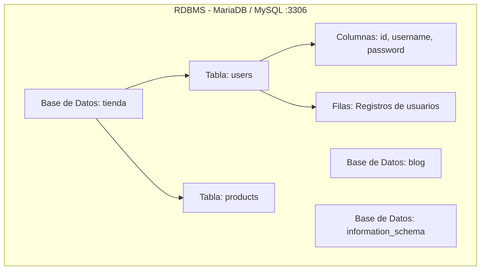
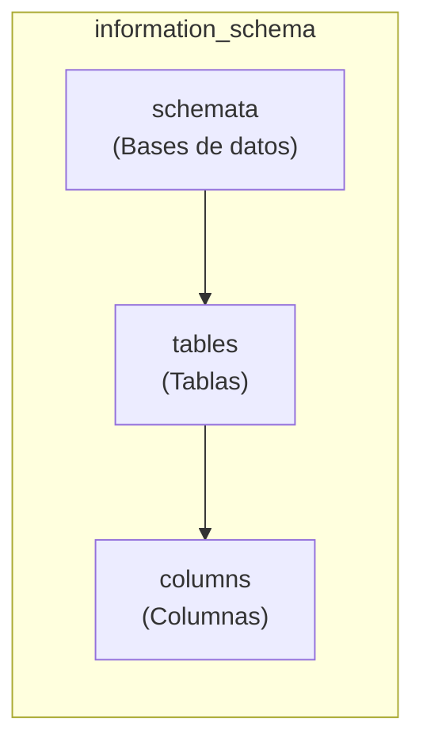
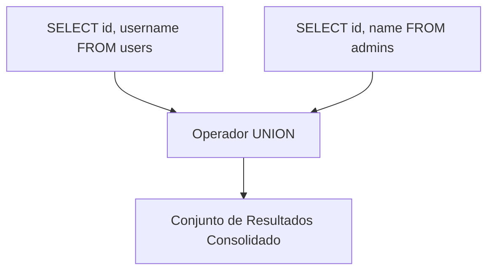
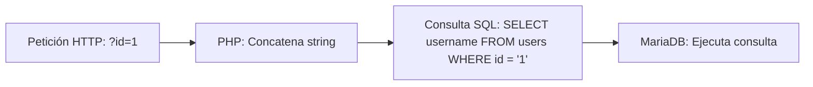

# Capítulo 02: Bases de Datos Relacionales y Fundamentos de SQL

[Inicio](../../README.md) | [Pentesting Web](../README.md) | [Anterior: Arquitectura Web y HTTP](../01-fundamentos-web-y-http/README.md) | [Siguiente: Inyecciones SQL Básicas](../03-sql-injection-fundamentos-y-logica/README.md) | [Laboratorio Práctico](./lab/)

| Campo | Valor |
|---|---|
| Estado | Disponible |
| Duración estimada | 3 a 4 horas |
| Nivel | Inicial |
| Modalidad | Lectura teórica en profundidad y laboratorio guiado con MariaDB |
| Prerrequisitos | Capítulo 01 (HTTP y modelo web), manejo básico de terminal Linux |

---

## Objetivos de aprendizaje

Al finalizar este capítulo serás capaz de:

- Comprender la arquitectura de un Sistema Gestor de Bases de Datos Relacionales (RDBMS) como MariaDB/MySQL y sus mecanismos de conexión.
- Operar con fluidez el cliente de línea de comandos `mysql`, navegando metadatos mediante `SHOW`, `USE`, `DESCRIBE` y sentencias de catálogo.
- Dominar la sintaxis del lenguaje SQL en sus vertientes de definición (DDL: `CREATE`, `ALTER`, `DROP`) y manipulación (DML: `SELECT`, `INSERT`, `UPDATE`, `DELETE`).
- Diseccionar la estructura lógica de una consulta `SELECT`, comprendiendo el orden de ejecución interno del motor de base de datos.
- Utilizar con precisión operadores de filtrado (`WHERE`), ordenación (`ORDER BY`), limitación (`LIMIT`), operadores lógicos (`AND`, `OR`, `NOT`) y patrones (`LIKE`).
- Comprender las reglas sintácticas estrictas del operador `UNION` y su importancia capital en técnicas de explotación web.
- Consultar las tablas del catálogo del sistema `information_schema` (`schemata`, `tables`, `columns`) para la enumeración de activos.
- Desplegar y validar un entorno vulnerable controlado con MariaDB, Apache y PHP para contrastar código dinámico frente a código seguro.

---

## 1. ¿Qué es una base de datos relacional y por qué se utiliza?

Una **base de datos** es un sistema organizado para almacenar, gestionar y recuperar información estructurada de manera concurrente, segura y persistente. Detrás de cualquier aplicación web moderna (portales de autenticación, tiendas de comercio electrónico, sistemas bancarios) reside un motor de base de datos.



### ¿Por qué las aplicaciones no guardan los datos en archivos de texto simples?

1. **Concurrencia**: Cientos o miles de peticiones HTTP simultáneas pueden leer y escribir al mismo tiempo sin corromper el almacenamiento gracias a bloqueos y transacciones.
2. **Integridad y restricciones**: Garantía de tipos de datos, unicidad de claves y restricciones referenciales (ACID: Atomicidad, Consistencia, Aislamiento y Durabilidad).
3. **Optimización de consultas**: Motores de indexación (como índices B-Tree en InnoDB) que permiten consultar millones de registros en milisegundos.
4. **Control de acceso granular**: Usuarios de base de datos con permisos acotados por tabla, vista o procedimiento.

---

## 2. MySQL / MariaDB: Arquitectura de conexión y primeros pasos

MariaDB y MySQL operan como servicios en segundo plano (*daemons*) que escuchan habitualmente en el puerto **3306/TCP**.

### Conexión mediante el cliente interactivo

Para administrar el servidor local desde la terminal en un entorno Linux:

```bash
sudo mysql -u root -p
```

- `-u root`: Especifica el usuario administrativo.
- `-p`: Solicita la contraseña interactiva. En muchas distribuciones modernas (Debian/Ubuntu), el acceso de `root` local se autentica directamente mediante sockets UNIX (`auth_socket`), por lo que `sudo mysql` conecta directamente sin pedir clave.

### Exploración jerárquica del servidor

Un auditor web o administrador sigue una secuencia mental ordenada para explorar un entorno desconocido:

```text
Servidor ---> Bases de datos (Schemas) ---> Tablas ---> Columnas y Tipos ---> Registros
```

Comandos interactivos de exploración:

```sql
-- 1. Listar todas las bases de datos presentes en el servidor
SHOW DATABASES;

-- 2. Seleccionar la base de datos de trabajo
USE tienda;

-- 3. Listar las tablas existentes dentro de la base seleccionada
SHOW TABLES;

-- 4. Inspeccionar las columnas, tipos y restricciones de una tabla
DESCRIBE users;
```

---

## 3. Modelo relacional: Tablas, Columnas, Filas y Tipos de Datos

En el modelo relacional:
- **Tabla**: Conjunto bidimensional que agrupa información sobre una entidad específica (ej. `users`, `invoices`, `products`).
- **Columna (Atributo)**: Campo con un nombre único y un tipo de dato estricto (`id`, `username`, `password_hash`).
- **Fila (Registro o Tupla)**: Una instancia concreta de datos que contiene valores para cada columna.
- **Clave Primaria (Primary Key - PK)**: Una columna (o conjunto de columnas) cuyo valor es estrictamente único y no nulo en cada fila, identificando unívocamente al registro.

### Tipos de datos SQL esenciales

| Tipo de dato | Ejemplo | Descripción y uso habitual | Relevancia en Pentesting |
|---|---|---|---|
| `INT` / `BIGINT` | `42`, `1001` | Números enteros. Identificadores de fila (IDs) y cantidades. | **No requiere comillas** delimitadoras en SQL (`WHERE id = 42`). |
| `VARCHAR(n)` | `'admin'`, `'ana'` | Cadenas de caracteres alfanuméricos de longitud variable hasta un máximo de $n$. | **Requiere comillas** delimitadoras (`WHERE username = 'admin'`). La comilla es el objetivo de rotura sintáctica. |
| `TEXT` | `'Texto largo...'` | Cadenas de gran tamaño (blogs, comentarios, descripciones). | Suele almacenar contenido que puede reflejarse en HTML (superficie para XSS). |
| `DATE` / `DATETIME` | `'2026-09-04 12:00:00'` | Fechas y marcas de tiempo. | Filtrado cronológico y registros de auditoría. |
| `FLOAT` / `DECIMAL` | `19.99` | Números con coma flotante o decimales exactos (precios, saldos). | Pruebas de redondeo o manipulación de balances. |

> [!NOTE]
> **Diferencia sintáctica crucial**: En SQL, los números se suministran directamente sin comillas (`SELECT * FROM users WHERE id = 1`), mientras que las cadenas deben encerrarse obligatoriamente entre comillas simples (`SELECT * FROM users WHERE username = 'admin'`). Esta distinción determina cómo debe estructurarse una prueba de inyección.

---

## 4. Clasificación del lenguaje SQL: DDL vs. DML

El lenguaje SQL se divide en dos categorías operativas primordiales:

### 4.1 Lenguaje de Definición de Datos (DDL - Data Definition Language)
Permite crear, modificar o destruir la estructura física y lógica de la base de datos:

```sql
-- Crear una tabla definiendo columnas y tipos
CREATE TABLE users (
    id INT AUTO_INCREMENT PRIMARY KEY,
    username VARCHAR(32) NOT NULL UNIQUE,
    password VARCHAR(64) NOT NULL
);

-- Modificar una tabla existente para agregar una nueva columna
ALTER TABLE users ADD email VARCHAR(64);

-- Eliminar una tabla completa y todos sus datos de forma irreversible
DROP TABLE users;
```

### 4.2 Lenguaje de Manipulación de Datos (DML - Data Manipulation Language)
Permite consultar y gestionar el contenido de las tablas existentes:

```sql
-- 1. Lectura (SELECT)
SELECT * FROM users;

-- 2. Inserción (INSERT)
INSERT INTO users (username, password) VALUES ('ana', 'p@ssw0rd123');

-- 3. Modificación (UPDATE)
UPDATE users SET password = 'nuevaPassword456' WHERE id = 1;

-- 4. Eliminación (DELETE)
DELETE FROM users WHERE id = 1;
```

> [!CAUTION]
> Un error clásico en sentencias `UPDATE` y `DELETE` es omitir la cláusula `WHERE`. Si ejecutas `DELETE FROM users;` sin `WHERE`, la base de datos eliminará **todos** los registros de la tabla sin confirmación previa.

---

## 5. El catálogo maestro del servidor: `information_schema`

MariaDB y MySQL incorporan una base de datos especial de sólo lectura denominada **`information_schema`**. Esta base actúa como el diccionario de datos o catálogo del servidor, registrando los metadatos de todas las demás bases de datos, tablas, columnas y privilegios configurados en la instancia.



Las tres vistas esenciales para un auditor son:

### 1. `information_schema.schemata`
Contiene la lista de todas las bases de datos gestionadas por el servidor:

```sql
SELECT schema_name FROM information_schema.schemata;
```

### 2. `information_schema.tables`
Contiene información sobre todas las tablas existentes en cualquier base de datos:

```sql
-- Listar todas las tablas que pertenecen a la base de datos 'tienda'
SELECT table_name, table_rows 
FROM information_schema.tables 
WHERE table_schema = 'tienda';
```

### 3. `information_schema.columns`
Contiene la relación detallada de cada columna definida en cada tabla:

```sql
-- Listar las columnas de la tabla 'users' dentro de la base 'tienda'
SELECT column_name, data_type 
FROM information_schema.columns 
WHERE table_schema = 'tienda' AND table_name = 'users';
```

> [!IMPORTANT]
> **Relevancia en Pentesting**: Durante un ataque de SQL Injection basada en UNION, el atacante no conoce los nombres de las tablas ni de las columnas del sistema. La consulta metódica a `information_schema` es la vía que permite mapear la totalidad de la estructura del servidor antes de proceder a la extracción de datos sensibles.

---

## 6. Consultas avanzadas y operadores en SQL

### 6.1 Proyecciones con `SELECT`

La instrucción `SELECT` permite recuperar registros. En entornos de producción, se desaconseja el uso de `SELECT *` y se prefieren proyecciones explícitas de columnas:

```sql
-- Devuelve únicamente las columnas requeridas
SELECT id, username FROM users;
```

### 6.2 Cláusula `WHERE` y evaluación condicional

La cláusula `WHERE` evalúa una expresión booleana por cada fila de la tabla; únicamente aquellas filas donde el resultado sea verdadero (`TRUE`) formarán parte del conjunto de respuesta.

```sql
SELECT * FROM users WHERE username = 'admin';
SELECT * FROM users WHERE id >= 10;
```

### 6.3 Operadores lógicos: `AND`, `OR`, `NOT`

- **`AND`**: Requiere que ambas condiciones sean verdaderas simultáneamente.
- **`OR`**: Se evalúa como verdadero si al menos una de las dos condiciones es verdadera.
- **`NOT`**: Invierte el valor booleano de la condición.

```sql
-- Ambas condiciones deben cumplirse
SELECT * FROM users WHERE id = 1 AND username = 'admin';

-- Basta con que se cumpla una
SELECT * FROM users WHERE id = 1 OR id = 2;

-- Niega la condición
SELECT * FROM users WHERE NOT username = 'guest';
```

> [!TIP]
> **La clave del bypass lógico**: Si un atacante consigue inyectar una condición unida por `OR` que siempre sea verdadera (como `OR 1=1`), toda la cláusula `WHERE` se evalúa como `TRUE`, provocando que el servidor devuelva todos los registros o valide una comprobación de acceso.

### 6.4 Cláusula `ORDER BY`

Permite ordenar el conjunto devuelto en función de una o más columnas, de forma ascendente (`ASC`, por defecto) o descendente (`DESC`):

```sql
SELECT * FROM users ORDER BY username ASC;
SELECT * FROM users ORDER BY id DESC;
```

**Ordenación por índice posicional**: SQL permite ordenar haciendo referencia al número de orden de la columna devuelta en lugar de su nombre:

```sql
-- Ordena por la primera columna devuelta (id)
SELECT id, username FROM users ORDER BY 1;

-- Ordena por la segunda columna devuelta (username)
SELECT id, username FROM users ORDER BY 2;
```

> [!IMPORTANT]
> **Fuzzing de columnas**: Si ejecutas `ORDER BY 3` en una consulta que solo proyecta 2 columnas, el motor de base de datos arrojará un error de sintaxis (`Unknown column '3' in 'order clause'`). Esta técnica permite descubrir de forma ciega el número exacto de columnas que devuelve una consulta vulnerable.

### 6.5 Cláusula `LIMIT`

Permite restringir la cantidad de filas devueltas por la consulta:

```sql
-- Devuelve como máximo 2 filas
SELECT * FROM users LIMIT 2;

-- Salta 1 fila (offset) y devuelve las siguientes 2 filas
SELECT * FROM users LIMIT 1, 2;
```

### 6.6 Operador `LIKE` y comodines de texto

Se utiliza para buscar coincidencias de patrones en campos de texto:
- `%`: Representa cero, uno o múltiples caracteres arbitrarios.
- `_`: Representa exactamente un único carácter.

```sql
-- Coincide con cualquier username que empiece por 'adm' (admin, administrador, etc.)
SELECT * FROM users WHERE username LIKE 'adm%';

-- Coincide con 'jane', 'lane', etc.
SELECT * FROM users WHERE username LIKE '_ane';
```

---

## 7. El operador `UNION`: Combinación de conjuntos

El operador `UNION` permite combinar los resultados de dos o más sentencias `SELECT` independientes en una única tabla de respuesta consolidada.



```sql
SELECT username FROM users
UNION
SELECT role_name FROM roles;
```

### Requisitos sintácticos obligatorios de `UNION`

Para que una consulta con `UNION` sea válida y no falle, deben cumplirse dos condiciones técnicas ineludibles:

1. **Mismo número exacto de columnas**: La segunda consulta debe retornar exactamente la misma cantidad de columnas que la primera consulta.
   - Si la consulta 1 devuelve 2 columnas, la consulta 2 debe devolver 2 columnas. De lo contrario, MariaDB arrojará:  
     `The used SELECT statements have a different number of columns`.
2. **Compatibilidad de tipos de datos**: Los tipos de datos de las columnas correspondientes deben ser compatibles entre sí (por ejemplo, una cadena de texto debe poder convivir en la columna donde la aplicación espera texto).

---

## 8. El origen del fallo: Concatenación dinámica en el Backend

Comprender el funcionamiento de SQL revela de inmediato la causa raíz de las inyecciones SQL. 

Cuando una aplicación web en PHP recibe un parámetro enviado por el usuario mediante HTTP GET (`$_GET['id']`) y lo inserta en una consulta construyendo una cadena de texto mediante concatenación:

```php
// CÓDIGO INSEGURO (Patrón vulnerable)
$id = $_GET['id'];
$query = "SELECT username FROM users WHERE id = '$id'";
$result = mysqli_query($conn, $query);
```



Si el parámetro `$id` es legítimo (`1`), la consulta resultante es válida. Sin embargo, los datos del usuario y las instrucciones del desarrollador viajan en la misma cadena sin separación semántica. Si el usuario manipula el parámetro, sus datos pasarán a alterar la estructura sintáctica del intérprete SQL.

---

## 9. Laboratorio guiado

Para poner en práctica estos conceptos y verificar el comportamiento de un entorno vulnerable controlado, dirígete a la carpeta del laboratorio:

👉 [Abrir la guía del laboratorio de PHP y MariaDB](./lab/README.md)

En este laboratorio:
1. Instalarás Apache, MariaDB y PHP en una máquina aislada.
2. Ejecutarás [`setup.sql`](./lab/setup.sql) para crear la base `tienda`, la tabla `users` y un usuario de aplicación `appuser` con privilegios estrictos de lectura.
3. Desplegarás el script [`searchusers.php`](./lab/searchusers.php).
4. Validarás el flujo completo de una petición HTTP hasta la base de datos.

---

## Preguntas de autoevaluación

1. ¿Cuál es la diferencia de comportamiento entre consultar un campo numérico (`INT`) y un campo alfanumérico (`VARCHAR`) en una cláusula `WHERE`?
2. ¿Por qué es fundamental que una aplicación web conecte a la base de datos con un usuario restringido (`appuser`) y nunca con `root`?
3. ¿Qué información almacena `information_schema` y por qué es tan valiosa para un auditor de seguridad?
4. Si intentas ejecutar `SELECT username FROM users UNION SELECT id, password FROM credentials;`, ¿qué error devolverá el motor SQL y cuál es la justificación técnica?
5. ¿Cómo puede emplearse la cláusula `ORDER BY` para determinar el número de columnas devueltas por una consulta `SELECT` que no podemos ver directamente?

---

[Anterior: Arquitectura Web y HTTP](../01-fundamentos-web-y-http/README.md) | [Volver al Índice de Pentesting Web](../README.md) | [Siguiente: Inyecciones SQL Básicas](../03-sql-injection-fundamentos-y-logica/README.md)
