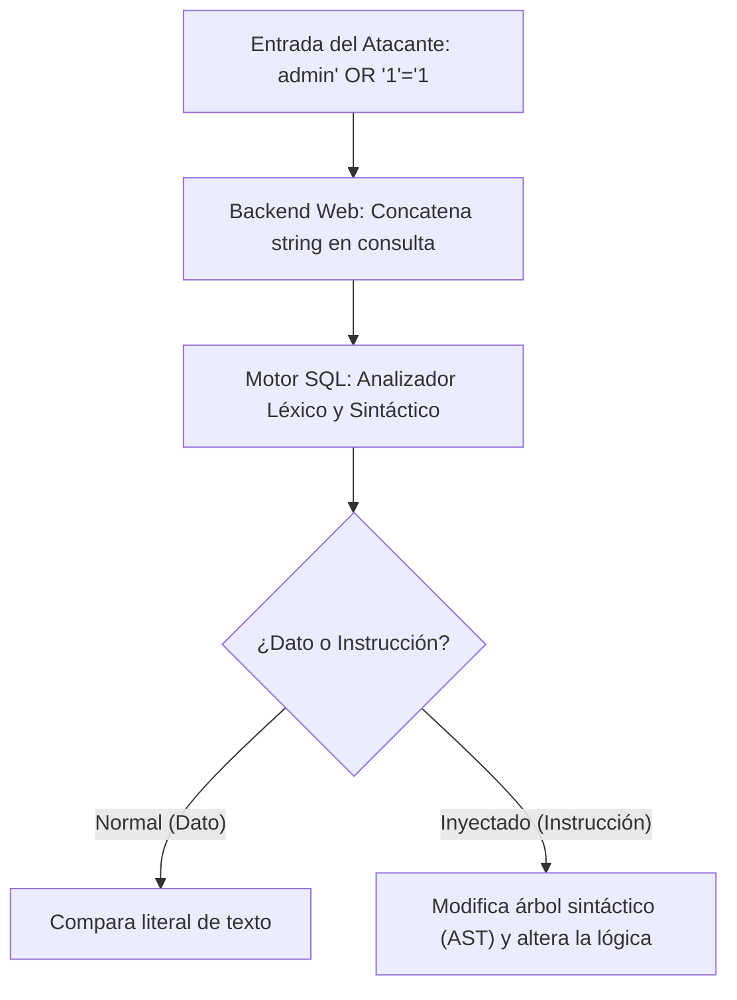
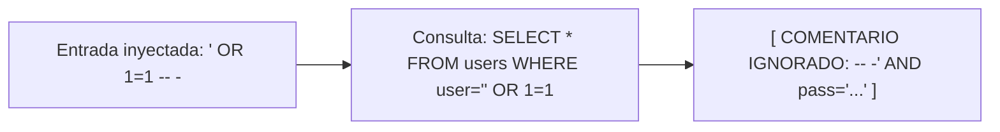

# Capítulo 03: Fundamentos de SQL Injection y Subversión de Lógica

[Inicio](../../README.md) | [Pentesting Web](../README.md) | [Anterior: Fundamentos de SQL](../02-fundamentos-sql/README.md) | [Siguiente: UNION SQL Injection y Burp Suite](../04-union-sql-injection-y-burp-suite/README.md)

| Campo | Valor |
|---|---|
| Estado | Disponible |
| Duración estimada | 3 a 4 horas |
| Nivel | Inicial - Intermedio |
| Modalidad | Lectura teórica exhaustiva, análisis de código y explotación controlada |
| Prerrequisitos | Capítulo 01 (Protocolo HTTP) y Capítulo 02 (Fundamentos de SQL) |

---

## Objetivos de aprendizaje

Al finalizar este capítulo serás capaz de:

- Explicar la causa raíz de las inyecciones SQL (CWE-89) como un problema fundamental de confusión de contexto entre datos e instrucciones.
- Comprender el comportamiento del analizador léxico (*lexer*) y sintáctico (*parser*) de un motor SQL ante entradas con comillas simples (`'`).
- Identificar y explotar vulnerabilidades de inyección SQL para subvertir la lógica booleana de consultas condicionales (`WHERE`).
- Ejecutar bypasses de autenticación mediante técnicas tautológicas y neutralización de código residual.
- Dominar la sintaxis de comentarios en SQL a través de diversos motores relacionales (MariaDB/MySQL, PostgreSQL, MSSQL, Oracle).
- Aplicar la técnica de subversión lógica a escenarios distintos al login, tales como filtrado de catálogos y extracción de registros ocultos.
- Reconocer indicios de vulnerabilidad mediante análisis de mensajes de error y respuestas anómalas del servidor.

---

## 1. ¿Qué es una SQL Injection? Causa raíz y anatomía

Una **Inyección SQL** (SQL Injection o SQLi, clasificada internacionalmente como **CWE-89**) es una vulnerabilidad de seguridad que se produce cuando una entrada de datos suministrada por un usuario no confiable es interpretada directamente como **código o instrucción sintáctica** por el intérprete del motor de base de datos.



### La causa real: Confusión de contexto

Contrario a la creencia común, la vulnerabilidad no se debe a la presencia de un carácter especial (como la comilla simple `'`), sino a la **pérdida de la frontera semántica entre datos e instrucciones**:

- **Contexto de Datos**: Los valores que la aplicación manipula (un nombre de usuario, un código postal, un ID de producto).
- **Contexto de Instrucción**: Las palabras clave y la estructura gramatical que indican al motor qué operaciones realizar (`SELECT`, `WHERE`, `AND`, `OR`).

Cuando un desarrollador construye una consulta mediante **concatenación dinámica de cadenas**, delega en el motor de base de datos la tarea de inferir dónde terminan los datos y dónde comienzan las órdenes.

---

## 2. La comilla simple (`'`): El detonante de la rotura sintáctica

Analicemos qué ocurre internamente en una consulta típica de autenticación en un backend web:

```sql
SELECT * FROM users WHERE username = '$user' AND password = '$password';
```

### Escenario A: Flujo legítimo

Un usuario introduce el nombre de usuario `ana` y la contraseña `clave123`. La consulta construida por el backend es:

```sql
SELECT * FROM users WHERE username = 'ana' AND password = 'clave123';
```

El analizador léxico de MariaDB identifica:
1. `username`: Columna a comparar.
2. `=`: Operador relacional.
3. `'`: Inicio de literal de cadena.
4. `ana`: Contenido del literal.
5. `'`: Fin del literal de cadena.
6. `AND`: Operador lógico que exige validar la segunda condición.

### Escenario B: Inserción de una comilla simple (`admin'`)

Si el usuario envía el valor `admin'`, la consulta resultante es:

```sql
SELECT * FROM users WHERE username = 'admin'' AND password = '...';
                                      ^^^^^^^
                                   Literal cerrado + comilla colgante
```

```text
SINTAXIS CORRUPTA:
SELECT * FROM users WHERE username = 'admin' ' AND password = '...';
                                     \_____/ |
                                     Cadena  Comilla "colgante" sin cerrar
                                     válida  (Error de sintaxis: Syntax Error)
```

1. La primera comilla de la entrada del usuario **cierra prematuramente** el literal de cadena de texto abierto por el programador.
2. La segunda comilla original queda desparejada ("comilla colgante" o *dangling quote*).
3. El analizador sintáctico no puede parsear la sentencia y arroja una excepción:
   `You have an error in your SQL syntax; check the manual that corresponds to your MariaDB server version...`

> [!TIP]
> **Técnica de detección primaria**: Enviar un carácter de comilla simple (`'`), comilla doble (`"`) o barra invertida (`\`) en cualquier parámetro y observar si la aplicación devuelve un código HTTP `500 Internal Server Error`, un mensaje explícito de base de datos o una respuesta inesperadamente vacía. Este es el primer indicio de que la entrada está concatenándose directamente.

---

## 3. Subversión lógica y Bypasses de autenticación

Una vez comprobado que la entrada rompe la sintaxis, el objetivo de la prueba es restaurar la validez sintáctica de la consulta pero **alterando su significado lógico** para que la condición booleana siempre evalúe a verdadero (*tautología*).

### Técnica 1: Tautología con comillas equilibradas (`' OR '1'='1`)

Si en el campo de usuario se inyecta:

```text
admin' OR '1'='1
```

La consulta final ejecutada en la base de datos se convierte en:

```sql
SELECT * FROM users WHERE username = 'admin' OR '1'='1' AND password = '$password';
```

Evaluación de la expresión lógica:
1. `'1'='1'` es una verdad axiomática matemática (siempre `TRUE`).
2. Debido al operador `OR`, basta con que una sola de las ramas sea verdadera para que toda la condición se considere satisfecha.
3. Si el motor evalúa la condición como verdadera, devuelve el registro correspondiente al usuario `admin`, autenticando al atacante sin necesidad de conocer la contraseña legítima.

---

## 4. El papel de los comentarios en SQL

En muchas consultas complejas, la entrada vulnerable está rodeada de cláusulas posteriores (comprobaciones de contraseñas, condiciones de estado activo, ordenaciones). Si dejamos que esas cláusulas se ejecuten, pueden invalidar la inyección o provocar errores de sintaxis por comillas residuales.

Para resolver esto, se utiliza un **delimitador de comentario** para truncar la consulta: todo lo que aparezca después del comentario será ignorado por el motor SQL.



### Sintaxis de comentarios según el motor de base de datos

| Motor de Base de Datos | Sintaxis de comentario en línea | Particularidades críticas |
|---|---|---|
| **MariaDB / MySQL** | `-- ` o `#` | **¡Atención!** La sintaxis `--` exige obligatoriamente que vaya seguida de al menos un **espacio en blanco** o carácter de control. Por ello, se suele escribir `-- -` (guion, guion, espacio, guion) para garantizar que los navegadores o proxies no recorten el espacio final. El símbolo `#` comenta directamente sin requerir espacio posterior. |
| **PostgreSQL** | `-- ` | Requiere espacio tras el doble guion; soporta comentarios multilínea `/* ... */`. |
| **Microsoft SQL Server (MSSQL)**| `--` | No exige espacio obligatorio tras `--`. |
| **Oracle Database** | `--` | No exige espacio obligatorio tras `--`. |
| **SQLite** | `--` | Comenta hasta el fin de la línea. |

### Técnica 2: Tautología con truncamiento (`' OR 1=1 -- -`)

Si el atacante suministra en el parámetro de usuario:

```text
' OR 1=1 -- -
```

La consulta resultante es:

```sql
SELECT * FROM users WHERE username = '' OR 1=1 -- -' AND password = '$password';
                                               |
                                     Resto de la consulta ANULADO
```

1. `username = ''` evalúa a falso (o busca un usuario vacío).
2. `OR 1=1` evalúa a verdadero.
3. `-- -` descarta por completo la comprobación de la contraseña `AND password = '...'` y neutraliza la comilla de cierre pendiente.
4. El motor ejecuta la consulta sin errores de sintaxis y retorna el primer usuario registrado en la tabla (comúnmente el administrador del sistema con `id = 1`).

### Técnica 3: Suplantación directa por nombre de usuario (`admin' -- -`)

Si el atacante conoce el nombre de usuario de la cuenta objetivo (`admin`), puede anular directamente la validación de contraseña:

```text
admin' -- -
```

Consulta resultante:

```sql
SELECT * FROM users WHERE username = 'admin' -- -' AND password = '$password';
```

El servidor busca al usuario `admin`, omite por completo la verificación de su contraseña y concede acceso inmediato a la sesión privilegiada.

---

## 5. Más allá del login: Manipulación de catálogos y filtros

La subversión lógica no se limita a paneles de autenticación; es aplicable a cualquier consulta donde intervenga un parámetro no saneado.

### Caso de estudio: Catálogo de productos con filtros de visibilidad

Consideremos una tienda web que muestra productos filtrados por categoría, pero que sólo debe mostrar productos cuyo estado sea "público" (`released = 1`):

```php
// Backend vulnerable
$category = $_GET['category'];
$query = "SELECT * FROM products WHERE category = '$category' AND released = 1";
```

### Inyección de subversión de visibilidad

Si un atacante envía en la URL:

```text
http://tienda.test/products.php?category=Gifts' OR 1=1 -- -
```

La consulta ejecutada será:

```sql
SELECT * FROM products WHERE category = 'Gifts' OR 1=1 -- -' AND released = 1
```

Efecto del ataque:
1. La cláusula `AND released = 1` es eliminada por el comentario.
2. La condición `OR 1=1` fuerza a que la consulta sea verdadera para absolutamente todos los registros de la tabla `products`.
3. La aplicación devuelve en pantalla:
   - Productos no lanzados (*unreleased*).
   - Productos archivados o dados de baja.
   - Productos de consumo interno no destinados a la venta pública.

---

## 6. Matriz de impacto y factores condicionantes

El impacto de una vulnerabilidad de SQL Injection depende de la interacción entre tres factores:

```text
IMPACTO REAL = (Tipo de Inyección) x (Estructura de la Consulta) x (Privilegios de la Conexión)
```

1. **Confidencialidad**: Extracción no autorizada de tablas completas, contraseñas, datos personales de clientes y tokens de sesión.
2. **Integridad**: Modificación arbitraria de registros (ej. alterar el rol de un usuario de `guest` a `admin`, o modificar saldos en cuentas) mediante sentencias apiladas o consultas de actualización.
3. **Disponibilidad**: Denegación de servicio (DoS) bloqueando tablas, consumiendo memoria con consultas pesadas de tiempo o ejecutando sentencias de destrucción (`DROP TABLE`).

### El peligro de los privilegios excesivos

- Si la aplicación conecta a la base de datos con un usuario con permisos de lectura y escritura acotados únicamente a la base `tienda`, el impacto queda confinado a esa base.
- Si la aplicación conecta con privilegios elevados (`root` o `DBA`):
  - El atacante puede leer o alterar las bases de datos de otras aplicaciones alojadas en el mismo servidor.
  - En motores como MySQL/MariaDB con permisos `FILE`, puede leer archivos del sistema operativo (`LOAD_FILE('/etc/passwd')`) o escribir webshells en el directorio web (`INTO OUTFILE '/var/www/html/shell.php'`).

---

## Práctica guiada: Verificación en el laboratorio local

Utilizando la máquina virtual configurada en el [Capítulo 02](../02-fundamentos-sql/README.md), valida los siguientes vectores contra el archivo vulnerable `searchusers.php`:

### Vector 1: Provocar el error de sintaxis

```bash
curl -s "http://localhost/searchusers.php?id=1'"
```

Observa la respuesta: ¿Muestra un error de sintaxis SQL o una página en blanco?

### Vector 2: Extraer todos los registros mediante tautología

```bash
curl -s "http://localhost/searchusers.php?id=1'+OR+'1'='1"
```

Observa cómo la consulta devuelve usuarios adicionales que no fueron solicitados explícitamente.

### Vector 3: Neutralizar con comentarios

```bash
# Nota: En URLs, el espacio debe codificarse como %20 o +
curl -s "http://localhost/searchusers.php?id=1'+OR+1=1+--+-"
```

---

## Preguntas de autoevaluación

1. ¿Por qué se afirma que la causa de una SQL Injection no es la comilla simple, sino la confusión de contexto entre datos e instrucciones?
2. Explica por qué en MariaDB/MySQL la secuencia de comentario `--` requiere obligatoriamente un espacio posterior para ser válida, y qué problema genera esto al transmitir la prueba por HTTP si no se codifica adecuadamente.
3. Describe el mecanismo mediante el cual el payload `' OR 1=1 -- -` logra eludir la comprobación de contraseña en un formulario de inicio de sesión.
4. Si un atacante inyecta `' OR 1=1 -- -` en un filtro de búsqueda de una aplicación web, ¿qué información no autorizada podría llegar a exponerse?
5. ¿De qué manera la política de "mínimos privilegios" en la cuenta de base de datos mitiga el impacto final de una SQL Injection?

---

[Anterior: Fundamentos de SQL](../02-fundamentos-sql/README.md) | [Volver al Índice de Pentesting Web](../README.md) | [Siguiente: UNION SQL Injection y Burp Suite](../04-union-sql-injection-y-burp-suite/README.md)
