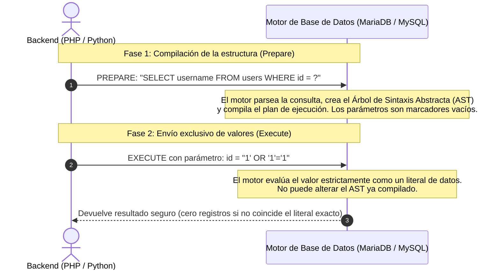
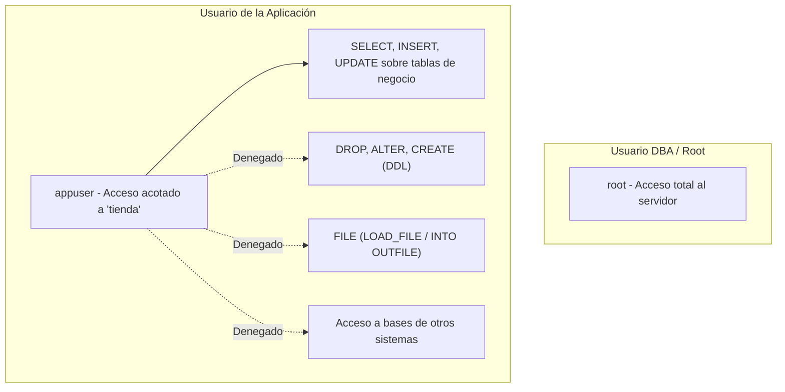

# Capítulo 05: Defensa en Profundidad, Remediación e Ingeniería Segura

[Inicio](../../README.md) | [Pentesting Web](../README.md) | [Anterior: UNION SQLi y Burp Suite](../04-union-sql-injection-y-burp-suite/README.md)

| Campo | Valor |
|---|---|
| Estado | Disponible |
| Duración estimada | 3 a 4 horas |
| Nivel | Intermedio |
| Modalidad | Lectura técnica, análisis de código seguro y mitigaciones en arquitectura |
| Prerrequisitos | Capítulos 01 a 04 de Pentesting Web |

---

## Objetivos de aprendizaje

Al finalizar este capítulo serás capaz de:

- Explicar la mecánica interna de las consultas preparadas (*Prepared Statements*) y justificar por qué resuelven la causa raíz de las inyecciones SQL.
- Implementar código seguro en PHP utilizando **PDO** y **MySQLi**, diferenciando la preparación real frente a la emulación.
- Aplicar validación estricta de tipos (*type casting*) y listas blancas (*allowlists*) para identificadores de tablas y ordenación.
- Diseñar una política de mínimos privilegios en MariaDB/MySQL para acotar el radio de impacto de una brecha en la aplicación.
- Implementar almacenamiento criptográfico seguro de contraseñas mediante funciones modernas con coste adaptable (Argon2id / bcrypt).
- Configurar el manejo de excepciones y errores para evitar la fuga de información sensible hacia el cliente.

---

## 1. La solución definitiva: Consultas Preparadas (Parameterized Queries)

La única solución robusta y matemáticamente garantizada contra las inyecciones SQL no es filtrar comillas mediante expresiones regulares, sino **restaurar la separación absoluta entre el código y los datos** a nivel de motor.



### ¿Por qué las consultas preparadas son inmunes a la inyección?

En una consulta preparada, el ciclo se divide en dos fases independientes:

1. **Fase de Preparación (`PREPARE`)**: El backend envía al motor de base de datos la plantilla de la consulta con marcadores de posición (habitualmente `?` o nombres como `:id`). El motor compila la sintaxis, valida los nombres de tablas y columnas y genera un plan de ejecución inmutable.
2. **Fase de Ejecución (`EXECUTE`)**: El backend transmite únicamente los valores que ocuparán esos marcadores. El motor trata esos valores **estrictamente como literales de datos**, independientemente de si contienen comillas, comentarios (`--`), palabras clave (`UNION`, `DROP`) o caracteres nulos.

---

## 2. Comparativa de implementación: Código Inseguro vs. Código Seguro

### 2.1 En PHP utilizando PDO (PHP Data Objects) - Estándar recomendado

#### Patrón Inseguro (Vulnerable a SQLi)
```php
// PELIGRO: Concatenación directa de datos en la cadena SQL
$id = $_GET['id'];
$sql = "SELECT username, email FROM users WHERE id = '$id'";
$result = $pdo->query($sql);
```

#### Patrón Seguro con PDO
```php
// SEGURO: Uso de prepared statements con marcadores de posición nombrados
$id = $_GET['id'];

$sql = "SELECT username, email FROM users WHERE id = :id";
$stmt = $pdo->prepare($sql);
$stmt->execute(['id' => $id]);
$user = $stmt->fetch(PDO::FETCH_ASSOC);
```

> [!IMPORTANT]
> **Atención con la emulación de PDO en MySQL**:  
> Por defecto en versiones antiguas o ciertas configuraciones, PDO emula la preparación en el cliente en lugar de delegarla al motor MySQL. Para forzar la preparación real en el servidor, debe configurarse:
> ```php
> $pdo->setAttribute(PDO::ATTR_EMULATE_PREPARES, false);
> ```

---

### 2.2 En PHP utilizando MySQLi

#### Patrón Inseguro
```php
$id = $_GET['id'];
$query = "SELECT username FROM users WHERE id = '$id'";
$result = mysqli_query($conn, $query);
```

#### Patrón Seguro con MySQLi Prepared Statements
```php
$id = $_GET['id'];

// 1. Preparar la plantilla con un marcador posicional (?)
$stmt = mysqli_prepare($conn, "SELECT username FROM users WHERE id = ?");

// 2. Vincular el parámetro indicando su tipo ('i' = integer, 's' = string)
mysqli_stmt_bind_param($stmt, "i", $id);

// 3. Ejecutar y recuperar resultados
mysqli_stmt_execute($stmt);
$result = mysqli_stmt_get_result($stmt);
$user = mysqli_fetch_assoc($result);
```

---

## 3. ¿Qué ocurre cuando no se pueden usar parámetros preparados?

Los marcadores de posición (`?` o `:nombre`) **solo pueden representar valores de datos** (literales que sustituyen cadenas o números en cláusulas `WHERE`, `VALUES` o `SET`).

**No es posible parametrizar sintácticamente**:
- Nombres de tablas (`SELECT * FROM ?`)
- Nombres de columnas (`SELECT ? FROM users`)
- Cláusulas de ordenación (`ORDER BY ?`)

Si una aplicación permite al usuario ordenar una tabla seleccionando la columna (`?sort=price`), ¿cómo evitamos una inyección SQL?

### La solución: Listas Blancas Estrictas (*Allowlists*)

```php
// Definición estricta de las únicas columnas permitidas
$allowed_columns = ['id', 'username', 'created_at', 'price'];

$sort = $_GET['sort'] ?? 'id';

// Validación estricta por lista blanca
if (!in_array($sort, $allowed_columns, true)) {
    // Si el valor no coincide exactamente con la lista, se revierte a un valor seguro por defecto
    $sort = 'id';
}

$direction = (isset($_GET['dir']) && strtoupper($_GET['dir']) === 'DESC') ? 'DESC' : 'ASC';

// Ahora la concatenación es segura porque $sort solo puede ser un valor legítimo predefinido
$query = "SELECT id, username FROM users ORDER BY $sort $direction";
```

### Tipado Fuerte y Cast de Enteros (*Type Casting*)

Para parámetros que representan identificadores numéricos, forzar el tipo en el backend descarta cualquier intento de inyección antes de que alcance la consulta:

```php
// Al forzar el cast a entero, cualquier inyección como "1' OR 1=1" se convierte en el número 1
$id = (int)$_GET['id'];
```

---

## 4. Principio de Menor Privilegio en la Base de Datos

Incluso si existiera un fallo en el código, una arquitectura de base de datos endurecida minimiza el impacto del atacante:



### Configuración de un usuario restringido en MariaDB

```sql
-- 1. Crear el usuario limitando su origen al localhost
CREATE USER 'appuser'@'localhost' IDENTIFIED BY 'ContraseñaFuerteYUnica#2026';

-- 2. Conceder únicamente los permisos estrictamente indispensables
GRANT SELECT, INSERT, UPDATE ON tienda.* TO 'appuser'@'localhost';

-- 3. Aplicar cambios
FLUSH PRIVILEGES;
```

> [!TIP]
> Nunca concedas privilegios `DROP`, `ALTER`, `GRANT OPTION` o el permiso global `FILE` al usuario de la aplicación web.

---

## 5. Almacenamiento seguro de contraseñas

Las contraseñas de los usuarios jamás deben almacenarse en texto plano ni mediante funciones de resumen criptográfico obsoletas o rápidas (como MD5, SHA-1 o SHA-256 sin salting y sin factor de coste).

### Por qué SHA-256 no es adecuado para contraseñas

SHA-256 fue diseñado para ser computacionalmente rápido (ideal para verificar sumas de archivos o firmas digitales). Un atacante con una GPU moderna puede calcular **miles de millones de hashes SHA-256 por segundo**, lo que hace trivial el crackeo mediante ataques de diccionario y tablas arcoíris (*Rainbow Tables*).

### Funciones modernas de derivación de claves con coste adaptable

Deben utilizarse algoritmos diseñados específicamente para el hashing de contraseñas con coste de CPU y memoria ajustable:
- **Argon2id**: Estándar ganador de la *Password Hashing Competition* (PHC). Proporciona resistencia contra ataques paralelos con GPU y circuitos integrados dedicados (ASICs).
- **bcrypt**: Algoritmo veterano y ampliamente contrastado basado en Blowfish.

#### Implementación segura en PHP

```php
// 1. Almacenar contraseña (hashing con sal automático y coste adaptable)
$hash = password_hash($plaintext_password, PASSWORD_ARGON2ID);
// Guardar $hash en la columna 'password' de la tabla 'users' (requiere VARCHAR(255))

// 2. Validar contraseña durante el inicio de sesión
if (password_verify($password_ingresada, $hash_almacenado)) {
    // Credenciales válidas: iniciar sesión
} else {
    // Credenciales inválidas
}
```

---

## 6. Endurecimiento de la configuración y manejo de errores

1. **Desactivar mensajes de error detallados en producción**:
   - En `php.ini`:
     ```ini
     display_errors = Off
     log_errors = On
     error_log = /var/log/php/error.log
     ```
   - Al ocultar los errores al usuario final, se mitigan los ataques de inyección basados en errores (*Error-based SQLi*).
2. **Cabeceras HTTP de respuesta seguras**:
   - `Content-Security-Policy`: Mitiga inyecciones de script en el cliente (XSS).
   - `X-Content-Type-Options: nosniff`: Evita que el navegador intente adivinar el tipo MIME de archivos.
   - `Strict-Transport-Security` (HSTS): Fuerza el uso exclusivo de HTTPS.
3. **Atributos de Cookies de Sesión**:
   - Asegurar que toda cookie de sesión se emita con `Secure`, `HttpOnly` y `SameSite=Strict` o `Lax`.

---

## Preguntas de autoevaluación

1. Explica detalladamente por qué una consulta que utiliza `PDO::prepare()` con parámetros vinculados es inmune a una inyección SQL aunque el atacante envíe comillas simples y comentarios.
2. Si un parámetro controla el nombre de la columna por la que se ordenan los resultados (`ORDER BY`), ¿por qué no es posible usar un marcador posicional `?` y qué técnica defensiva debe implementarse en su lugar?
3. ¿Cuál es el riesgo de seguridad si el backend conecta a la base de datos con el usuario `root` de MariaDB en lugar de un usuario con permisos acotados?
4. ¿Por qué una función de hash rápida como SHA-256 no es segura para almacenar contraseñas, y qué ventajas ofrece un algoritmo como Argon2id?
5. ¿Qué directivas de configuración de PHP deben ajustarse en producción para impedir que los mensajes de error de la base de datos se revelen en la interfaz del usuario?

---

[Anterior: UNION SQLi y Burp Suite](../04-union-sql-injection-y-burp-suite/README.md) | [Volver al Índice de Pentesting Web](../README.md)
