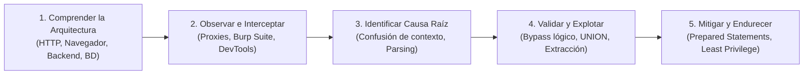
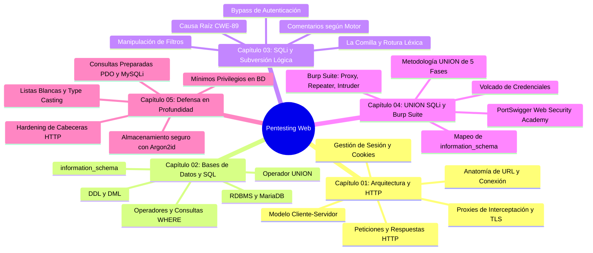

# Pentesting Web: Guía Práctica e Integral de Seguridad Web

[Inicio](../README.md) | [Configurar laboratorio](../setup/README.md)

Un recurso técnico, abierto y estructurado como libro de aprendizaje para comprender la arquitectura de las aplicaciones web, dominar el análisis e interceptación de tráfico HTTP, auditar vulnerabilidades críticas desde la raíz y aplicar ingeniería defensiva en entornos controlados.

> [!CAUTION]
> **Alcance y Ética**: El material, código y laboratorios publicados en este recurso tienen un propósito estrictamente educativo y de investigación defensiva. Las técnicas aquí expuestas deben practicarse exclusivamente en máquinas virtuales locales aisladas o sistemas para los que cuentes con autorización expresa por escrito. El autor no se responsabiliza del uso indebido de esta información.

---

## Prólogo y Filosofía de Aprendizaje

Para evaluar la seguridad de una aplicación web de forma profesional, no basta con ejecutar herramientas automáticas ni memorizar listas de *payloads*. La verdadera maestría en pentesting web requiere **comprender con rigor cómo interactúan los protocolos de red, los servidores web, los lenguajes de backend y los motores de bases de datos**.

Este libro digital se estructura bajo la metodología:



---

## Roadmap de Estudio



---

## Tabla de Contenidos (Índice de Capítulos)

| # | Capítulo | Descripción técnica | Duración | Nivel | Práctica / Lab | Estado |
|---|---|---|---|---|---|---|
| **01** | [**Arquitectura Web y Protocolo HTTP**](./01-fundamentos-web-y-http/README.md) | Modelo cliente-servidor, fronteras de confianza, anatomía de URL, ciclo de vida TCP/TLS/HTTP, métodos, cabeceras, cookies seguras y proxies de interceptación. | 3 - 4 h | Inicial | Prácticas con `curl` y DevTools | **Disponible** |
| **02** | [**Bases de Datos Relacionales y SQL**](./02-fundamentos-sql/README.md) | Arquitectura de MariaDB/MySQL, exploración interactiva, sentencias DDL y DML, operadores lógicos, ordenación, operador UNION y catálogo `information_schema`. | 3 - 4 h | Inicial | [Laboratorio PHP y MariaDB](./02-fundamentos-sql/lab/) | **Disponible** |
| **03** | [**SQL Injection y Subversión de Lógica**](./03-sql-injection-fundamentos-y-logica/README.md) | Causa raíz de CWE-89, confusión de contexto, la comilla simple y rotura léxica, bypasses de autenticación, comentarios por motor y alteración de filtros. | 3 - 4 h | Inicial - Intermedio | Pruebas controladas con la app local | **Disponible** |
| **04** | [**UNION SQL Injection y Burp Suite**](./04-union-sql-injection-y-burp-suite/README.md) | Metodología de 5 fases en UNION SQLi, extracción estructurada de `information_schema`, operativa con Burp Suite (Proxy, Repeater, Intruder) y laboratorios PortSwigger. | 4 - 5 h | Intermedio | Web Security Academy y Burp Suite | **Disponible** |
| **05** | [**Ingeniería Defensiva y Mitigaciones**](./05-defensa-en-profundidad-y-mitigaciones/README.md) | Consultas preparadas en PDO y MySQLi, validación por listas blancas, principio de menor privilegio en BD, hashing de contraseñas con Argon2id y cabeceras de respuesta. | 3 - 4 h | Intermedio | Análisis y refactorización de código | **Disponible** |

---

## Matriz de Cobertura de Estándares

| Estándar | Identificador | Nombre | Capítulo cubierto |
|---|---|---|---|
| **OWASP Top 10** | A01:2021 | Broken Access Control (Control de Acceso Roto) | [Capítulo 01](./01-fundamentos-web-y-http/README.md), [Capítulo 03](./03-sql-injection-fundamentos-y-logica/README.md) |
| **OWASP Top 10** | A03:2021 | Injection (Inyecciones) | [Capítulo 03](./03-sql-injection-fundamentos-y-logica/README.md), [Capítulo 04](./04-union-sql-injection-y-burp-suite/README.md) |
| **OWASP Top 10** | A07:2021 | Identification and Authentication Failures | [Capítulo 01](./01-fundamentos-web-y-http/README.md), [Capítulo 03](./03-sql-injection-fundamentos-y-logica/README.md), [Capítulo 05](./05-defensa-en-profundidad-y-mitigaciones/README.md) |
| **CWE** | CWE-89 | Improper Neutralization of Special Elements used in an SQL Command ('SQL Injection') | [Capítulo 03](./03-sql-injection-fundamentos-y-logica/README.md), [Capítulo 04](./04-union-sql-injection-y-burp-suite/README.md), [Capítulo 05](./05-defensa-en-profundidad-y-mitigaciones/README.md) |
| **CWE** | CWE-602 | Client-Side Enforcement of Server-Side Security | [Capítulo 01](./01-fundamentos-web-y-http/README.md) |
| **CWE** | CWE-614 | Sensitive Cookie in HTTPS Session Without 'Secure' Attribute | [Capítulo 01](./01-fundamentos-web-y-http/README.md) |
| **CWE** | CWE-1004 | Sensitive Cookie Without 'HttpOnly' Flag | [Capítulo 01](./01-fundamentos-web-y-http/README.md) |
| **CWE** | CWE-250 | Execution with Unnecessary Privileges | [Capítulo 02](./02-fundamentos-sql/README.md), [Capítulo 05](./05-defensa-en-profundidad-y-mitigaciones/README.md) |

---

## Preparación del Entorno de Prácticas

Para ejecutar los laboratorios prácticos de este recurso:
1. Revisa la [Guía de Configuración del Laboratorio](../setup/README.md).
2. Utiliza una máquina virtual Debian, Ubuntu o Kali Linux configurada en una red aislada (*Host-Only*).
3. Asegúrate de tener instalados los servicios esenciales:
   ```bash
   sudo apt update
   sudo apt install -y apache2 mariadb-server php php-mysql curl
   ```
4. Para la interceptación y resolución de laboratorios avanzados, descarga [Burp Suite Community Edition](https://portswigger.net/burp/communitydownload).

---

## Cómo Contribuir y Progresar

1. Estudia los capítulos en orden secuencial comenzando por el [Capítulo 01](./01-fundamentos-web-y-http/README.md).
2. Resuelve las preguntas de autoevaluación al final de cada capítulo antes de continuar al siguiente.
3. Monta el laboratorio local del [Capítulo 02](./02-fundamentos-sql/lab/README.md) y reproduce manualmente cada una de las pruebas descritas.
4. Conecta con los retos guiados de Web Security Academy en el [Capítulo 04](./04-union-sql-injection-y-burp-suite/README.md).

[Volver al Catálogo Principal del Repositorio](../README.md)
